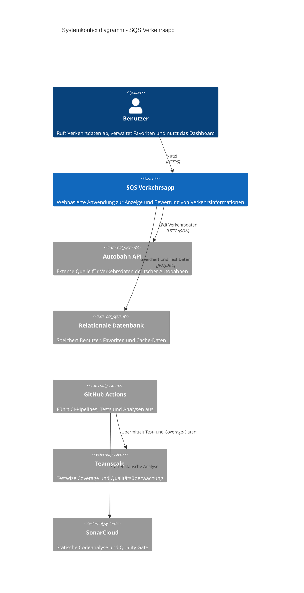
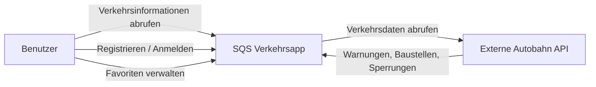
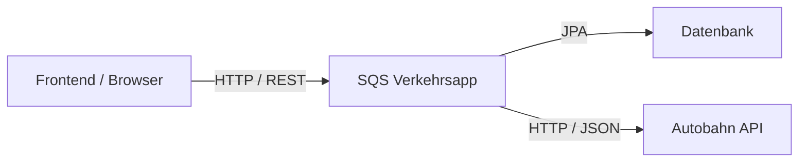

# 03. Kontextabgrenzung

## 3.1 Systemkontextdiagramm

Zeigt die SQS Verkehrsapp als Gesamtsystem im Umfeld ihrer Benutzer und externen Systeme.

Enthält:

- Benutzer
- SQS Verkehrsapp
- Frontend / Browser
- Autobahn API
- Datenbank
- GitHub Actions
- Teamscale
- SonarCloud



### Fachlicher Kontext

Die SQS Verkehrsapp stellt Verkehrsinformationen für deutsche Autobahnen bereit und ermöglicht Benutzern die Verwaltung persönlicher Favoritenlisten.

Die Anwendung fungiert als Vermittler zwischen den Benutzern und einer externen Autobahn-API. Zusätzlich werden Benutzer- und Cache-Daten lokal gespeichert, um die Verfügbarkeit des Systems zu erhöhen.

#### Fachliches Kontextdiagramm



---

### Fachliche Schnittstellen

#### Benutzer → SQS Verkehrsapp

Der Benutzer interagiert über REST-Endpunkte mit dem System.

Bereitgestellte Funktionen:

* Registrierung
* Anmeldung
* Abruf von Verkehrsinformationen
* Verwaltung gespeicherter Autobahnen
* Dashboard mit Favoriteninformationen

---

#### SQS Verkehrsapp → Autobahn API

Die Anwendung verwendet eine externe Autobahn-API als primäre Datenquelle.

Abgerufene Informationen:

* Warnmeldungen
* Baustellen
* Sperrungen
* verfügbare Autobahnen

Die Fachlogik der Anwendung verarbeitet diese Informationen und ergänzt sie um Risikobewertungen.

---

### Technischer Kontext

Aus technischer Sicht besteht die Anwendung aus mehreren logisch getrennten Komponenten.

#### Technisches Kontextdiagramm



---

## 3.2 Frontend

Das Frontend ist eine React/TypeScript-Anwendung, die im Browser des Benutzers ausgeführt wird.

Es kommuniziert ausschließlich über die REST-API des Backends und stellt folgende Funktionen bereit:

* Anzeige verfügbarer Autobahnen und Verkehrsereignisse
* Registrierung und Anmeldung
* Verwaltung gespeicherter Autobahnen
* Dashboard-Ansicht für Favoriten
* Anzeige des Cache-Status bei API-Ausfall

---

## 3.3 Externe Systeme

### Autobahn API

Die Autobahn API stellt aktuelle Verkehrsinformationen bereit.

Verwendete Daten:

* Warnungen
* Baustellen
* Sperrungen
* Autobahnlisten

Die Kommunikation erfolgt über HTTP und JSON.

---

### Datenbank

Die Datenbank wird für folgende Informationen genutzt:

#### Benutzerdaten

* Benutzer-ID
* Benutzername
* Passwort-Hash

#### Favoriten

* gespeicherte Autobahnen

#### Verkehrs-Cache

* Verkehrsmeldungen
* Cache-Zeitpunkte

#### Autobahn-Cache

* verfügbare Autobahnlisten

---

## 3.4 Systemgrenze

Die Systemgrenze umfasst das Frontend und das Backend als gemeinsam entwickelte und deployete Einheit.

### Innerhalb der Systemgrenze

```text
Frontend (React/TypeScript)
Controller
Use Cases
Services
Domain Model
Ports
Adapter
Security
Persistence
Cache
```

### Außerhalb der Systemgrenze

```text
Benutzer (Browser)
Autobahn API
Datenbankserver
```

---

## 3.5 Kommunikationsbeziehungen

### Eingehende Kommunikation

| Quelle   | Ziel     | Protokoll  |
| -------- | -------- | ---------- |
| Frontend | REST API | HTTP/HTTPS |

---

### Ausgehende Kommunikation

| Quelle      | Ziel         | Protokoll  |
| ----------- | ------------ | ---------- |
| WebClient   | Autobahn API | HTTP/HTTPS |
| JPA Adapter | Datenbank    | JDBC       |

---

## 3.6 Sicherheitsrelevante Schnittstellen

### Öffentliche Endpunkte

Die folgenden Endpunkte können ohne Authentifizierung aufgerufen werden:

```text
/api/auth/register
/api/auth/login
/api/traffic/**
/actuator/**
```

---

### Geschützte Endpunkte

Die folgenden Bereiche benötigen ein gültiges JWT:

```text
/api/dashboard/**
/api/saved-roads/**
```

---

## 3.7 Kontextbezogene Qualitätsanforderungen

Die Kontextabgrenzung wird insbesondere durch folgende Anforderungen beeinflusst:

### Hohe Verfügbarkeit

Bei Ausfall der Autobahn API sollen weiterhin Daten über den lokalen Cache bereitgestellt werden.

---

### Sicherheit

Benutzerbezogene Funktionen dürfen ausschließlich authentifizierten Benutzern zugänglich sein.

---

### Wartbarkeit

Externe Systeme sollen austauschbar sein, ohne Änderungen an der Fachlogik zu verursachen.

Dies wird durch die Verwendung von Ports und Adaptern sichergestellt.

---

## 3.8 Zusammenfassung

Die SQS Verkehrsapp befindet sich zwischen Benutzern und einer externen Autobahn-API. Sie erweitert die bereitgestellten Verkehrsdaten um zusätzliche Fachlogik, Risikobewertungen, Benutzerverwaltung und Caching-Funktionalitäten.

Die klar definierte Systemgrenze bildet die Grundlage für die in den folgenden Kapiteln beschriebene Lösungsstrategie und Architektur.

