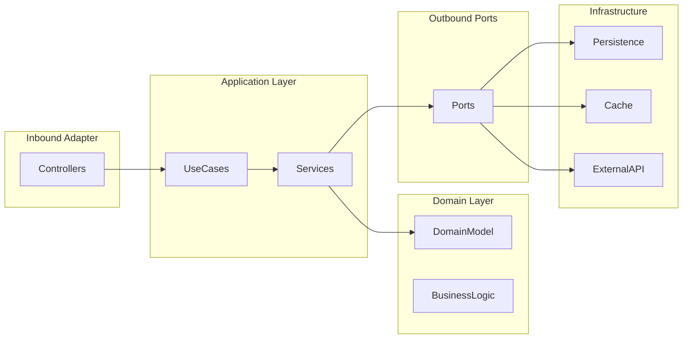

# 04. Lösungsstrategie

## 4.1 Überblick

Die Architektur der SQS Verkehrsapp wurde mit dem Ziel entwickelt, eine wartbare, testbare und ausfallsichere Lösung zur Verarbeitung von Verkehrsdaten bereitzustellen.

Die zentralen Herausforderungen des Systems bestehen in:

* der Integration externer Verkehrsdatenquellen,
* der sicheren Verwaltung von Benutzern,
* der Bereitstellung personalisierter Funktionen,
* der Gewährleistung einer hohen Verfügbarkeit trotz externer Abhängigkeiten.

Zur Erfüllung dieser Anforderungen wurde eine Hexagonale Architektur (Ports & Adapters) gewählt.

---

## 4.2 Architekturansatz

### Hexagonale Architektur

Die Anwendung folgt dem Prinzip der Hexagonalen Architektur nach Alistair Cockburn.

Ziel dieser Architektur ist die klare Trennung zwischen:

* Fachlogik
* Infrastruktur
* Benutzeroberflächen
* externen Systemen

Dadurch bleibt der Anwendungskern unabhängig von technischen Details.

### Architekturübersicht



---

## 4.3 Trennung der Verantwortlichkeiten

### Präsentationsschicht

Verantwortlich für:

* REST-Endpunkte
* HTTP-Anfragen
* HTTP-Antworten
* Authentifizierungsinformationen

Komponenten:

```text id="v3y4h8"
AuthController
TrafficController
SavedRoadController
DashboardController
GlobalExceptionHandler
```

---

### Anwendungsschicht

Verantwortlich für:

* Anwendungsfälle
* Orchestrierung von Fachlogik
* Kommunikation mit Ports

Komponenten:

```text id="j0n7ab"
AuthService
TrafficService
SavedRoadService
DashboardTrafficService
```

---

### Domänenschicht

Verantwortlich für:

* Fachliche Regeln
* Risikobewertung
* Domänenobjekte

Komponenten:

```text id="f7wd1m"
RiskScoreCalculator

RoadEvent
TrafficEventsResult
SavedRoad
AppUser
```

---

### Infrastrukturschicht

Verantwortlich für:

* Datenbankzugriffe
* API-Kommunikation
* Caching
* Security

Komponenten:

```text id="l2xq9w"
UserAdapter
SavedRoadAdapter
RoadEventCacheAdapter
AvailableRoadsCacheAdapter
ResilientAutobahnApiAdapter
JwtService
JwtAuthenticationFilter
```

---

## 4.4 Port-and-Adapter-Konzept

### Input Ports

Input Ports definieren die fachlichen Anwendungsfälle.

```text id="jvw8rt"
AuthUseCase
TrafficQueryUseCase
SavedRoadUseCase
DashboardTrafficUseCase
```

Controller kommunizieren ausschließlich über diese Schnittstellen.

---

### Output Ports

Output Ports definieren externe Abhängigkeiten.

```text id="ny0suy"
UserPort
SavedRoadPort
AutobahnApiPort
RoadEventCachePort
AvailableRoadCachePort
```

Die Fachlogik kennt ausschließlich diese Schnittstellen.

---

### Vorteile

* Hohe Testbarkeit
* Austauschbare Infrastruktur
* Geringe Kopplung
* Klare Verantwortlichkeiten

---

## 4.5 Sicherheitsstrategie

### JWT-basierte Authentifizierung

Die Anwendung verwendet JSON Web Tokens (JWT) zur Authentifizierung.

Ablauf:

1. Benutzer registriert sich oder meldet sich an.
2. Das System erstellt ein JWT.
3. Das Token wird bei Folgeanfragen übertragen.
4. Ein Filter validiert das Token.
5. Der Benutzer wird im Security Context authentifiziert.

### Vorteile

* Stateless Authentication
* Keine Session-Verwaltung
* Gute Skalierbarkeit

---

## 4.6 Resilience-Strategie

Die Anwendung ist von einer externen Autobahn-API abhängig.

Um Ausfälle abzufangen, werden mehrere Schutzmechanismen kombiniert.

### Retry

Temporäre Fehler werden automatisch erneut ausgeführt.

---

### Circuit Breaker

Wiederholte Fehler führen zum Öffnen des Circuit Breakers.

Dadurch werden unnötige Anfragen an nicht erreichbare Systeme vermieden.

---

### Cache Fallback

Wenn die externe API nicht erreichbar ist:

1. Suche im lokalen Cache.
2. Rückgabe gespeicherter Daten.
3. Ausnahme nur bei fehlenden Cache-Daten.

### Vorteile

* Hohe Verfügbarkeit
* Bessere Benutzererfahrung
* Geringere Ausfallzeiten

---

## 4.7 Caching-Strategie

### Verkehrsereignisse

Für jede Autobahn werden Verkehrsmeldungen lokal gespeichert.

Ziele:

* Schnellere Antwortzeiten
* API-Entlastung
* Fallback-Unterstützung

---

### Autobahnlisten

Verfügbare Autobahnen werden ebenfalls lokal gespeichert.

Dadurch können auch bei API-Ausfällen weiterhin bekannte Autobahnen verarbeitet werden.

---

### Asynchrones Schreiben

Cache-Operationen werden asynchron durchgeführt.

Vorteile:

* Kürzere Antwortzeiten
* Entkopplung von Benutzeranfragen und Persistenz

---

## 4.8 Integrationsstrategie

### Externe API

Die Kommunikation mit der Autobahn-API erfolgt über einen dedizierten Client.

Architekturprinzip:

```text id="ch91sj"
API → DTO → Mapper → Domain Model
```

Dadurch bleibt die Domäne vollständig von externen Datenstrukturen entkoppelt.

---

### Persistenz

Der Zugriff auf die Datenbank erfolgt über:

```text id="g2bzpi"
Spring Data JPA
Repositories
Persistence Adapter
```

Die Fachlogik besitzt keinen direkten Datenbankzugriff.

---

## 4.9 Qualitätsstrategie

Die Architektur wurde gezielt zur Unterstützung der priorisierten Qualitätsziele entwickelt.

| Qualitätsziel     | Architekturmaßnahme           |
| ----------------- | ----------------------------- |
| Wartbarkeit       | Hexagonale Architektur        |
| Testbarkeit       | Ports und Adapter             |
| Sicherheit        | JWT + Spring Security         |
| Ausfallsicherheit | Retry, Circuit Breaker, Cache |
| Erweiterbarkeit   | Entkoppelte Schnittstellen    |
| Performance       | Lokale Cache-Strategie        |

---

## 4.10 Wesentliche Architekturentscheidungen

Die folgenden Entscheidungen prägen die Architektur des Systems:

### ADR-001

Verwendung einer Hexagonalen Architektur.

### ADR-002

JWT-basierte Authentifizierung.

### ADR-003

Konsequente Nutzung von Input- und Output-Ports.

### ADR-004

Resilience4j für Retry- und Circuit-Breaker-Mechanismen.

### ADR-005

Domänengetriebene Risikobewertung.

### ADR-006

Stateless Authentication.

### ADR-007

Dedizierte DTO-Mapper.

### ADR-008

Asynchrones Cache-Schreiben.

### ADR-009

Persistenz über Spring Data JPA.

### ADR-010

Datenbankgestützter Cache.

---

## 4.11 Zusammenfassung

Die Architektur der SQS Verkehrsapp basiert auf einer klaren Trennung von Fachlogik und Infrastruktur. Die Kombination aus Hexagonaler Architektur, JWT-Sicherheit, Resilience-Mechanismen und Datenbank-Caching ermöglicht eine wartbare, testbare und robuste Lösung für die Verarbeitung von Verkehrsdaten.

Die folgenden Kapitel beschreiben die einzelnen Bausteine und deren Zusammenarbeit im Detail.

