# 05. Bausteinsicht

## 5.1 Überblick

Die Bausteinsicht beschreibt die statische Struktur der SQS Verkehrsapp und die wichtigsten Architekturbausteine des Systems.

Die Anwendung ist nach den Prinzipien der Hexagonalen Architektur aufgebaut und gliedert sich in die folgenden Ebenen:

* Inbound Adapter
* Application Layer
* Domain Layer
* Outbound Ports
* Infrastructure Layer

Die Fachlogik bildet den Mittelpunkt des Systems und ist vollständig von technischen Implementierungsdetails entkoppelt.

---

## 5.2 Ebene 1 – Gesamtsystem

### Systemübersicht

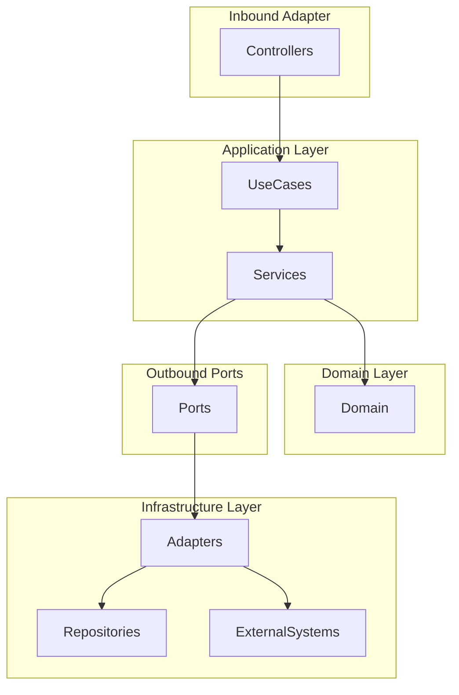

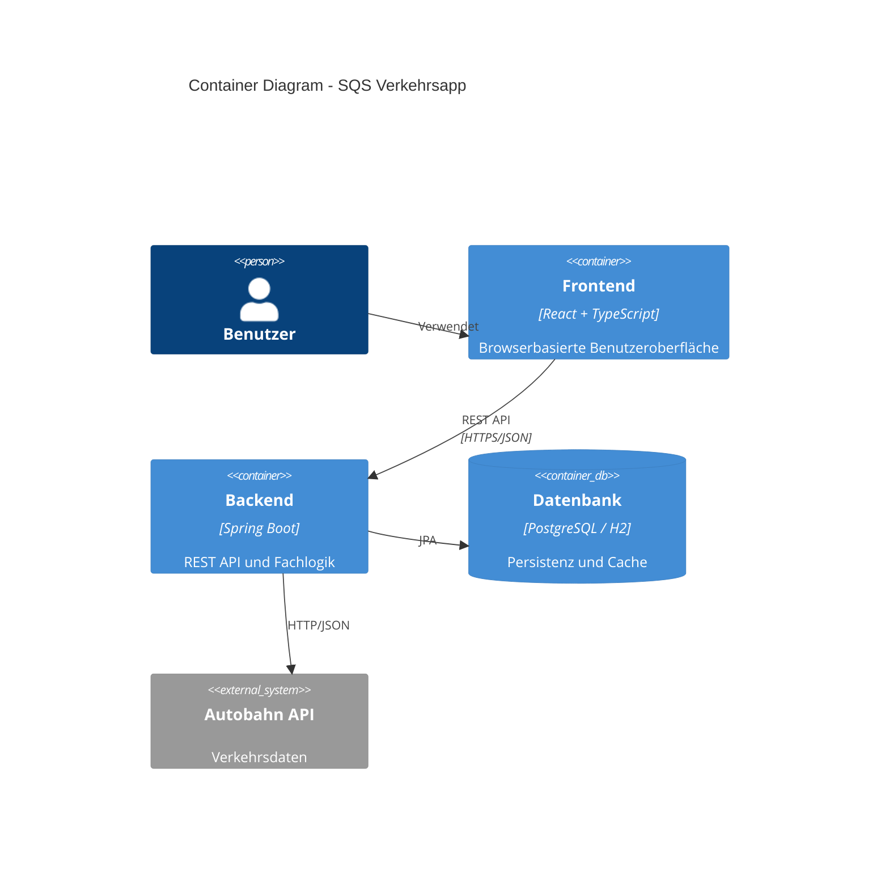

---

### Hauptverantwortlichkeiten

| Ebene                | Verantwortung            |
| -------------------- | ------------------------ |
| Inbound Adapter      | REST-Kommunikation       |
| Application Layer    | Anwendungsfälle          |
| Domain Layer         | Fachlogik                |
| Outbound Ports       | Infrastrukturabstraktion |
| Infrastructure Layer | Datenbank, Cache, API    |

---
## 5.3 Komponentendiagramm Backend

Zeigt die interne Struktur des Spring-Boot-Backends nach Hexagonaler Architektur.

Enthält:

- Inbound Adapter
- Application Layer
- Domain Layer
- Ports
- Outbound Adapter
- Repositories
- externe API
- Cache

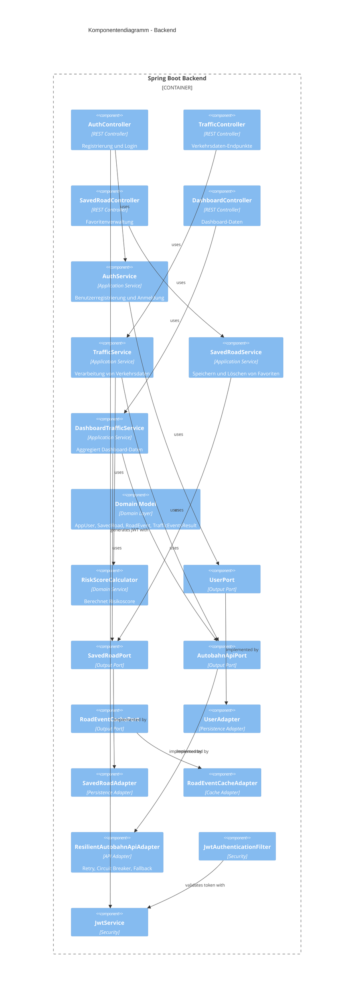

### Ebene 2 – Inbound Adapter

Die Inbound Adapter bilden die öffentliche Schnittstelle des Systems.

#### Komponentenübersicht

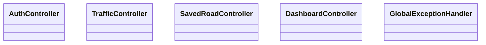

---

#### AuthController

##### Verantwortung

* Registrierung neuer Benutzer
* Anmeldung bestehender Benutzer
* JWT-Erzeugung

##### Verwendete Komponenten

```text
AuthUseCase
JwtService
```

---

#### TrafficController

##### Verantwortung

Bereitstellung von Verkehrsinformationen.

##### Endpunkte

```text
GET /api/traffic
GET /api/traffic/{roadId}
```

---

#### SavedRoadController

##### Verantwortung

Verwaltung gespeicherter Autobahnen.

##### Endpunkte

```text
POST   /api/saved-roads
GET    /api/saved-roads
DELETE /api/saved-roads/{roadId}
```

---

#### DashboardController

##### Verantwortung

Abruf personalisierter Dashboard-Daten.

##### Endpunkt

```text
GET /api/dashboard
```

---

#### GlobalExceptionHandler

##### Verantwortung

Zentrale Behandlung fachlicher und technischer Fehler.

---

### Ebene 2 – Application Layer

Die Application Layer implementiert die Anwendungsfälle des Systems.

#### Struktur


---

#### Input Ports

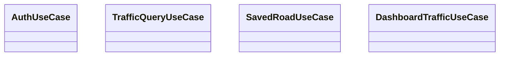

##### Verantwortung

Definition aller fachlichen Anwendungsfälle.

---

#### Services

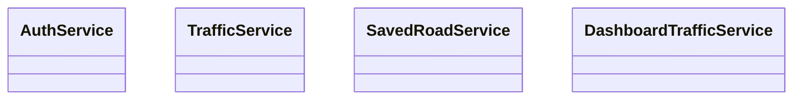

---

##### AuthService

Verantwortlich für:

* Benutzerregistrierung
* Benutzeranmeldung
* Passwortvalidierung

---

##### TrafficService

Verantwortlich für:

* Abruf von Verkehrsdaten
* Risikoscore-Berechnung
* Aggregation von Verkehrsinformationen

---

##### SavedRoadService

Verantwortlich für:

* Speichern von Autobahnen
* Abruf gespeicherter Autobahnen
* Löschen gespeicherter Autobahnen

---

##### DashboardTrafficService

Verantwortlich für:

* Zusammenführung gespeicherter Autobahnen
* Abruf zugehöriger Verkehrsdaten
* Dashboard-Aufbereitung

---

### Ebene 2 – Domain Layer

Die Domäne enthält die eigentliche Fachlogik.

#### Domänenübersicht

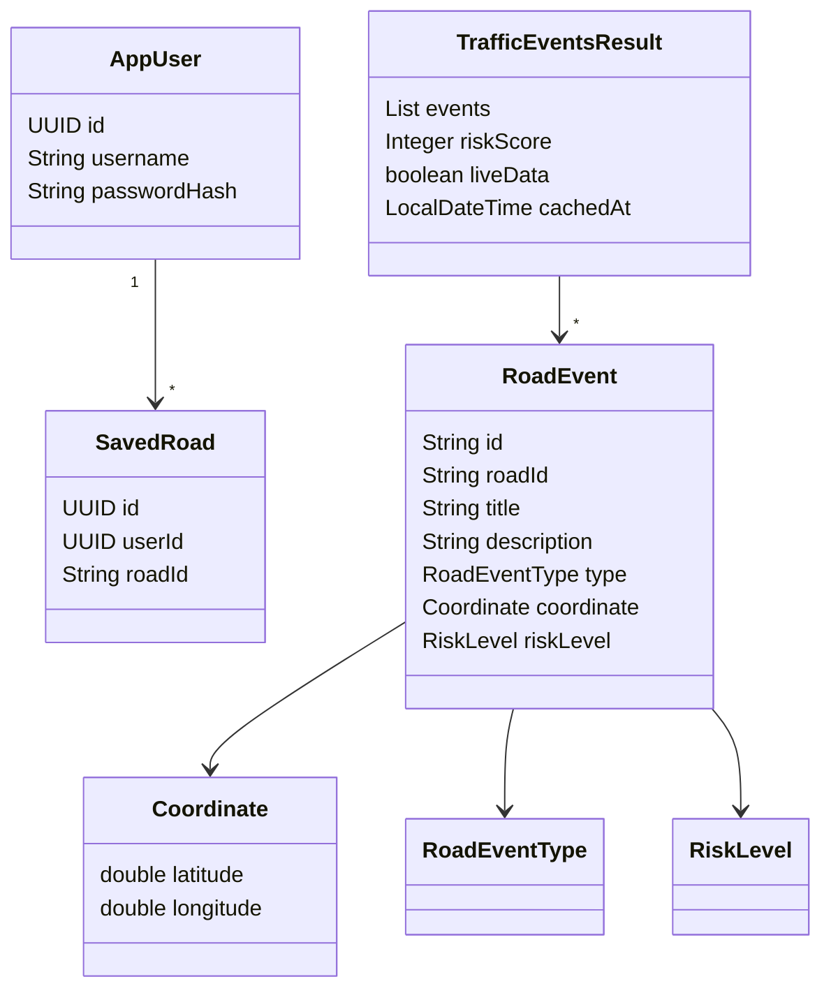

---

#### AppUser

Repräsentiert einen Benutzer der Anwendung.

##### Attribute

```text
id
username
passwordHash
```

---

#### SavedRoad

Repräsentiert eine gespeicherte Autobahn.

##### Attribute

```text
id
userId
roadId
```

---

#### RoadEvent

Repräsentiert ein einzelnes Verkehrsereignis.

##### Attribute

```text
id
roadId
title
subtitle
description
type
coordinate
riskLevel
```

---

#### TrafficEventsResult

Kapselt das Ergebnis einer Verkehrsabfrage.

##### Enthält

```text
events
liveData
cachedAt
riskScore
```

---

#### RiskScoreCalculator

Zentrale fachliche Komponente zur Bewertung von Verkehrssituationen.

##### Aufgaben

* Risikostufe bestimmen
* Risikoscore berechnen
* Normierung auf Wertebereich 0–100

---

### Ebene 2 – Outbound Ports

Outbound Ports abstrahieren alle externen Abhängigkeiten.

#### Übersicht

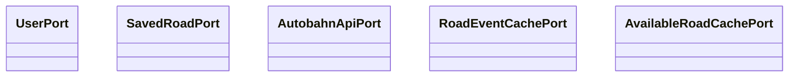

---

#### UserPort

Verantwortlich für Benutzerpersistenz.

---

#### SavedRoadPort

Verantwortlich für Favoritenpersistenz.

---

#### AutobahnApiPort

Verantwortlich für Verkehrsdatenzugriffe.

---

#### RoadEventCachePort

Verantwortlich für Verkehrsereignis-Caching.

---

#### AvailableRoadCachePort

Verantwortlich für Autobahnlisten-Caching.

---

### Ebene 2 – Infrastructure Layer

Die Infrastructure Layer implementiert alle technischen Schnittstellen.

#### Adapterübersicht


---

#### Persistenzadapter

##### UserAdapter

Implementiert:

```text
UserPort
```

Verantwortlich für:

* Speichern von Benutzern
* Benutzerabfragen

---

##### SavedRoadAdapter

Implementiert:

```text
SavedRoadPort
```

Verantwortlich für:

* Favoritenverwaltung

---

##### RoadEventCacheAdapter

Implementiert:

```text
RoadEventCachePort
```

Verantwortlich für:

* Cache-Verwaltung von Verkehrsdaten

---

##### AvailableRoadsCacheAdapter

Implementiert:

```text
AvailableRoadCachePort
```

Verantwortlich für:

* Cache verfügbarer Autobahnen

---

#### API-Integration

##### ResilientAutobahnApiAdapter

Implementiert:

```text
AutobahnApiPort
```

Verantwortlich für:

* Retry
* Circuit Breaker
* Cache Fallback

---

##### AutobahnApiClient

Verantwortlich für:

* HTTP-Kommunikation
* API-Aufrufe

---

##### AutobahnApiMapper

Verantwortlich für:

* DTO → Domain Mapping

---

##### AutobahnCacheWriter

Verantwortlich für:

* asynchrone Cache-Aktualisierung

---

## 5.2 Ebene 3 – Persistenzmodell

### Entity-Struktur

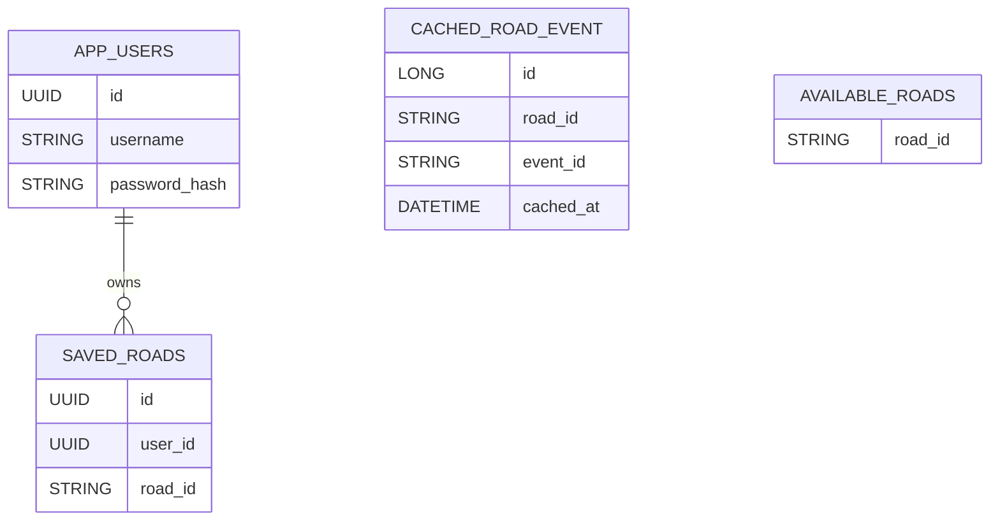

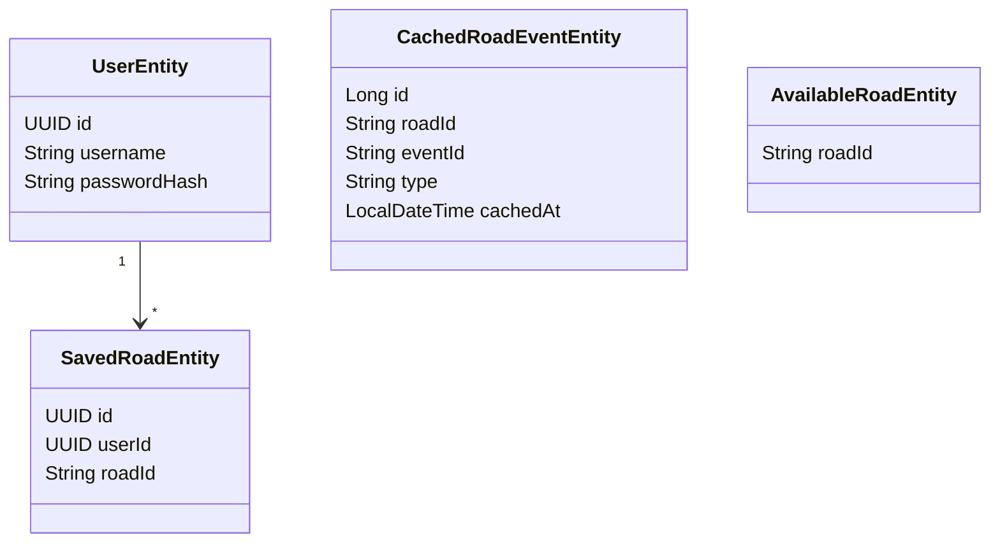

---

## 5.3 Bausteinabhängigkeiten

### Vollständige Komponentenübersicht

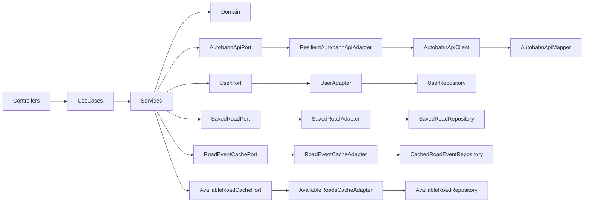

---

## 5.4 Zusammenfassung

Die Bausteinsicht zeigt die konsequente Umsetzung der Hexagonalen Architektur.

Wesentliche Eigenschaften:

* Klare Trennung von Fachlogik und Infrastruktur
* Verwendung von Ports und Adaptern
* Hohe Testbarkeit
* Austauschbare Infrastrukturkomponenten
* Geringe Kopplung
* Hohe Wartbarkeit

Die dargestellten Bausteine bilden die Grundlage für die in Kapitel 6 beschriebenen Laufzeitszenarien.

