# 06. Laufzeitsicht

## 6.1 Überblick

Die Laufzeitsicht beschreibt das dynamische Verhalten der SQS Verkehrsapp während der Ausführung.

Im Fokus stehen die wichtigsten fachlichen Abläufe:

* Benutzerregistrierung
* Benutzeranmeldung
* Abruf von Verkehrsdaten
* Dashboard-Abfrage
* Speichern favorisierter Autobahnen
* Ausfallszenarien mit Cache-Fallback

Die dargestellten Szenarien zeigen die Zusammenarbeit der wichtigsten Architekturbausteine.

---

## 6.2 Benutzerregistrierung

### Ziel

Ein neuer Benutzer registriert sich im System.

### Ablauf

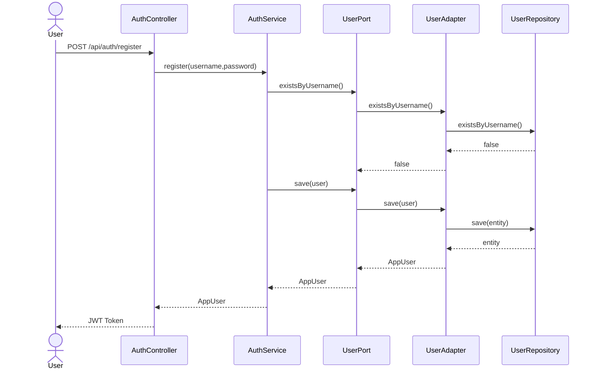

---

## 6.3 Benutzeranmeldung

### Ziel

Ein Benutzer authentifiziert sich und erhält ein JWT.

### Ablauf

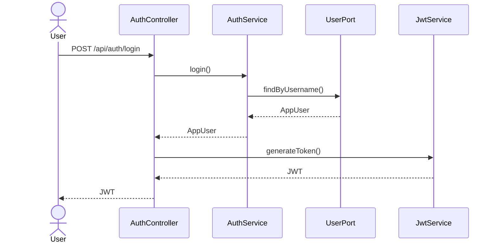

---

## 6.4 Authentifizierte Anfrage

### Ziel

Ein Benutzer ruft eine geschützte Ressource auf.

### Ablauf

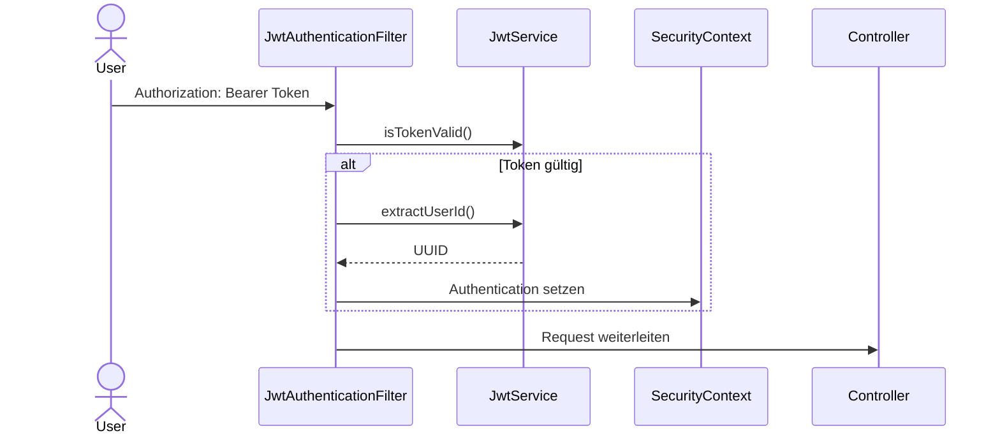

---

## 6.5 Verkehrsdaten für eine Autobahn abrufen

### Ziel

Abruf aller Verkehrsmeldungen für eine bestimmte Autobahn.

### Ablauf

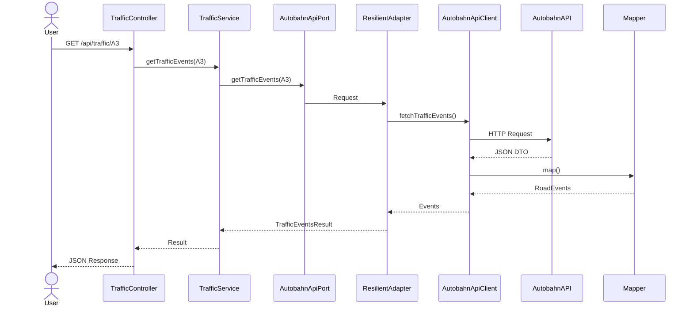

---

## 6.6 Risikobewertung von Verkehrsdaten

### Ziel

Berechnung eines normierten Risikoscores.

### Ablauf

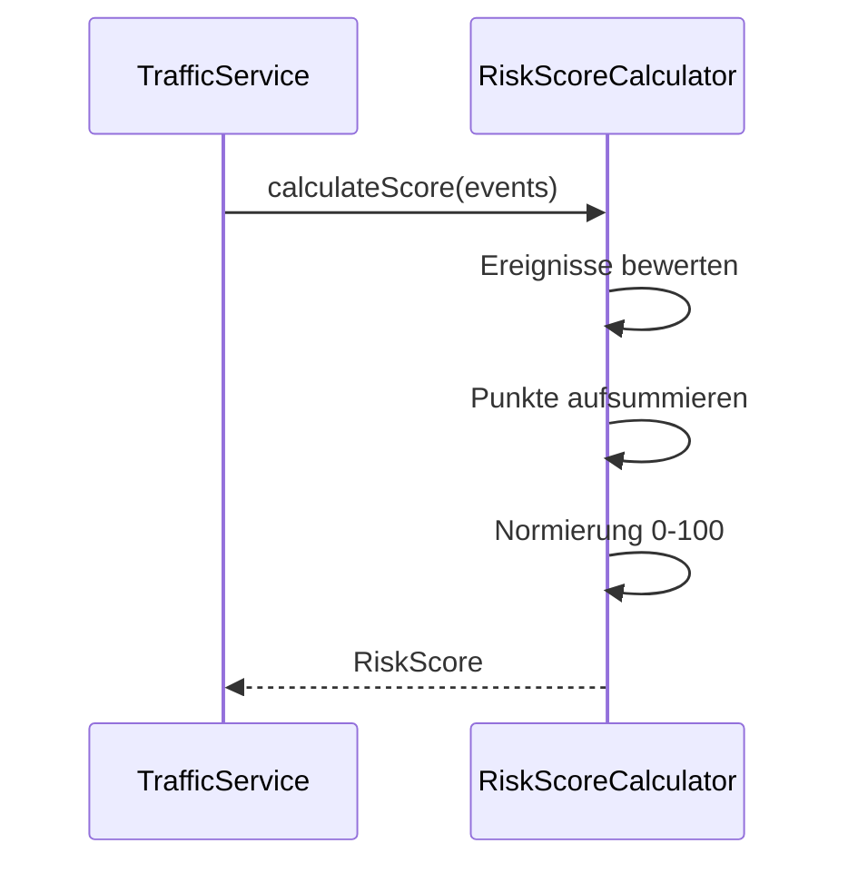

---

## 6.7 Dashboard-Abfrage

### Ziel

Anzeige aller gespeicherten Autobahnen eines Benutzers inklusive Verkehrsdaten.

### Ablauf

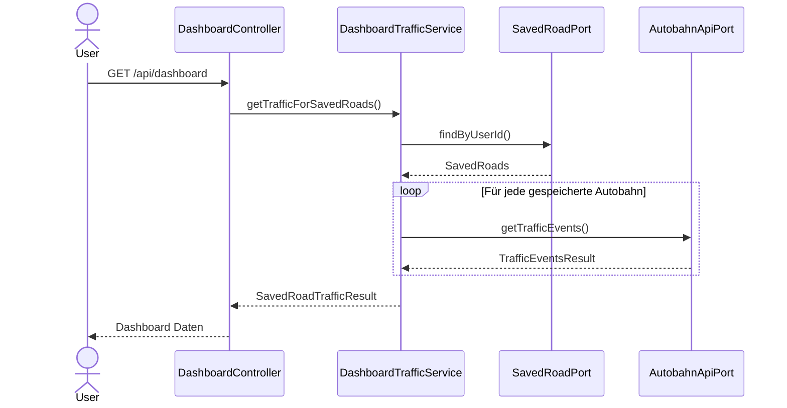

---

## 6.8 Autobahn speichern

### Ziel

Ein Benutzer speichert eine Autobahn als Favorit.

### Ablauf

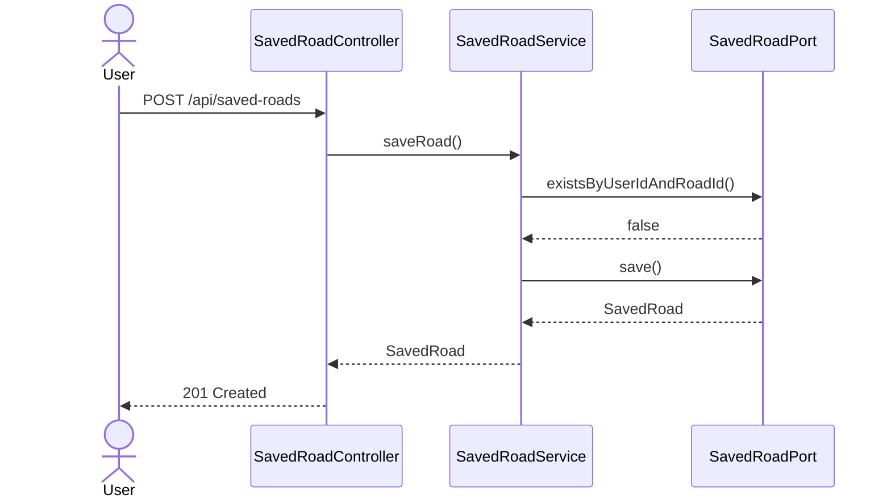

---

## 6.9 Cache-Aktualisierung

### Ziel

Speicherung neu geladener Verkehrsdaten.

### Ablauf

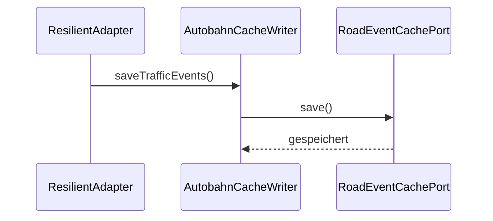

Die Speicherung erfolgt asynchron und beeinflusst die Antwortzeit der Benutzeranfrage nicht.

---

## 6.10 Ausfallszenario – API nicht erreichbar

### Ziel

Bereitstellung von Verkehrsdaten trotz Ausfall der externen API.

### Ablauf

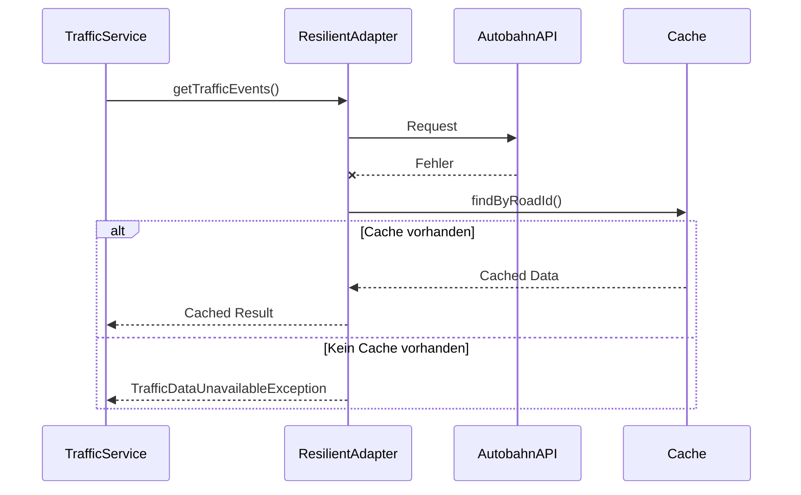

---

## 6.11 Ausfallszenario – Verfügbare Autobahnen

### Ziel

Bereitstellung der Autobahnliste bei API-Ausfall.

### Ablauf

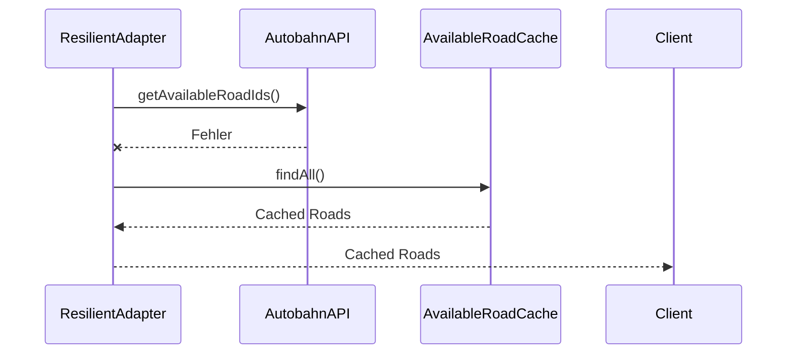

---

## 6.12 Fehlerbehandlung

### Ziel

Einheitliche Fehlerkommunikation.

### Ablauf

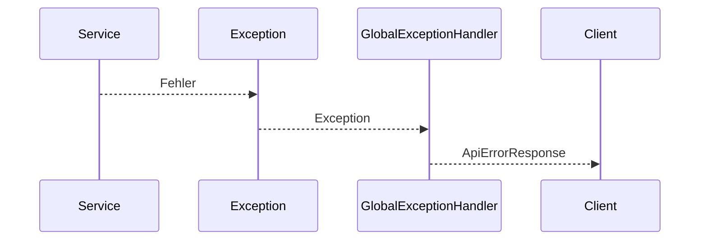

---

## 6.13 Frontend – Seitenstart und Datenladen

### Ziel

Der Benutzer öffnet die Anwendung. Das Frontend lädt alle Autobahnen und Verkehrsdaten automatisch beim Start.

### Ablauf

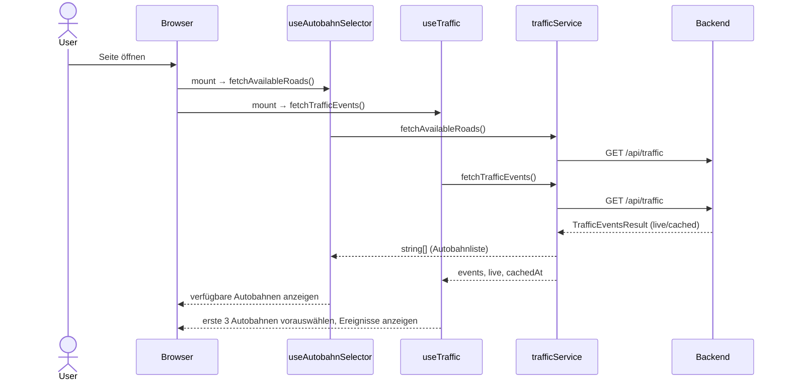

---

## 6.14 Frontend – Benutzeranmeldung

### Ziel

Ein Benutzer meldet sich über das Auth-Modal an.

### Ablauf

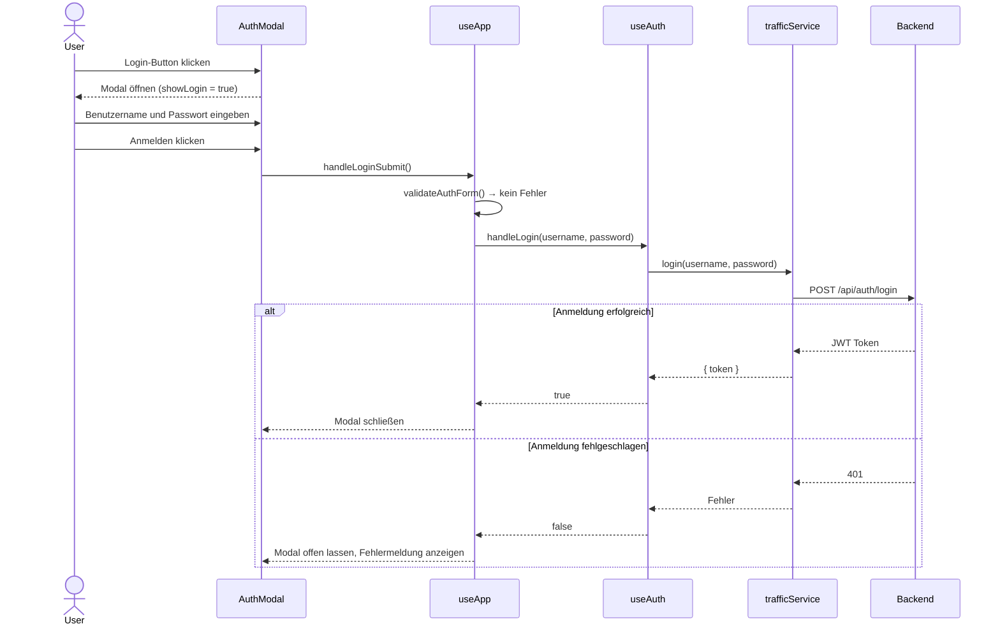

---

## 6.15 Frontend – Cache-Anzeige bei API-Ausfall

### Ziel

Das Backend liefert gecachte Daten. Das Frontend zeigt einen Cache-Indikator an.

### Ablauf

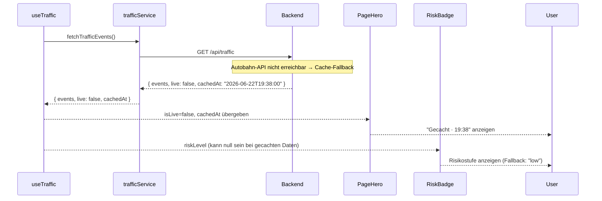

---

## 6.16 Laufzeitverhalten im Überblick

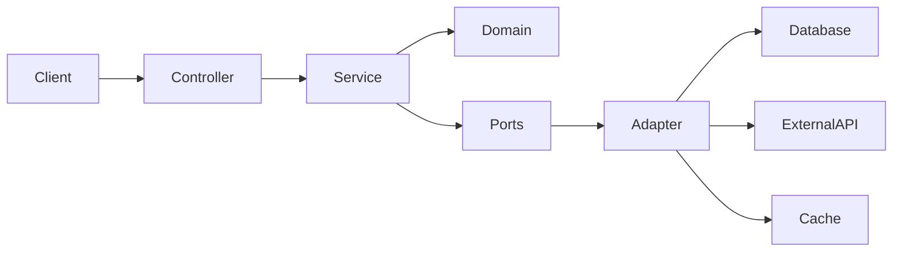

---

## 6.17 Zusammenfassung

Die Laufzeitsicht zeigt die wichtigsten Interaktionen innerhalb der Anwendung.

Besonders relevante Eigenschaften sind:

* Klare Trennung von Verantwortlichkeiten
* JWT-basierte Authentifizierung
* Verwendung von Ports und Adaptern
* Asynchrones Caching
* Retry- und Circuit-Breaker-Mechanismen
* Cache-Fallback bei API-Ausfällen
* Zentrale Fehlerbehandlung

Diese Abläufe bilden die Grundlage für die in Kapitel 7 beschriebene Verteilungssicht.

