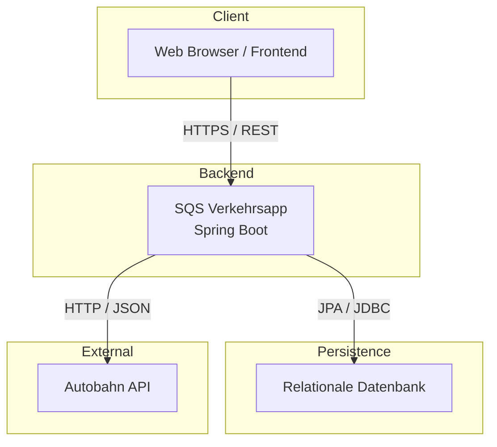
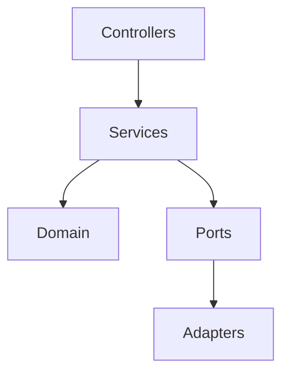
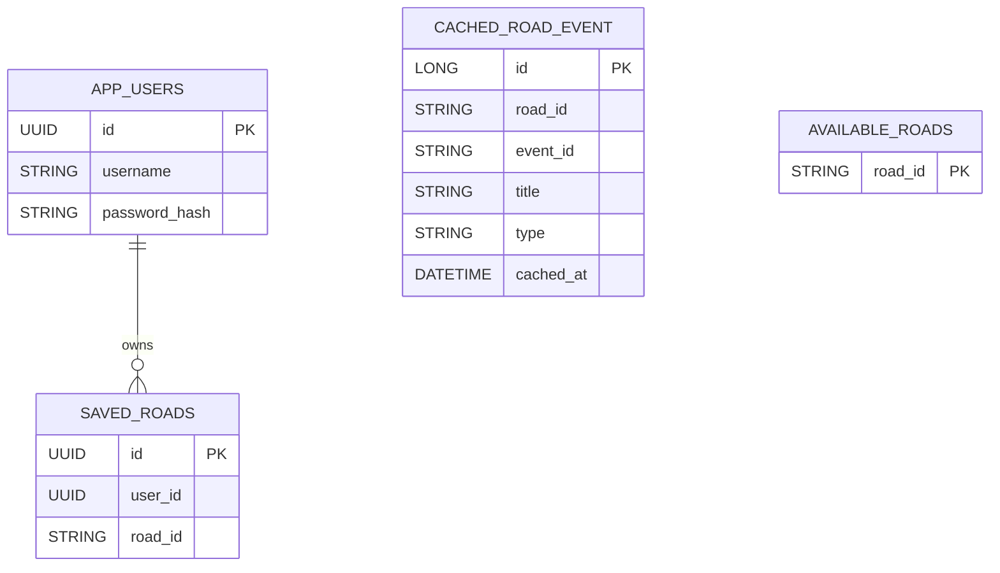
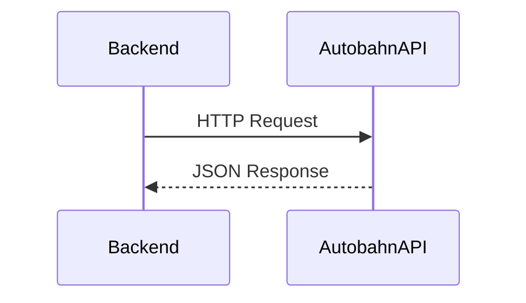
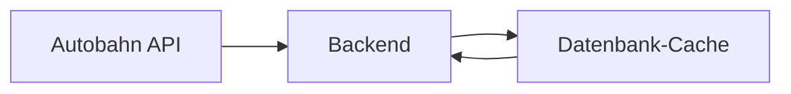
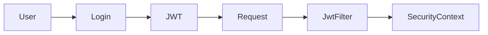

# 07. Verteilungssicht

## 7.1 Überblick

Die Verteilungssicht beschreibt die physische Verteilung der Softwarekomponenten auf Laufzeitumgebungen sowie die technischen Kommunikationsbeziehungen zwischen den beteiligten Systemen.

Die SQS Verkehrsapp ist als Spring-Boot-Anwendung konzipiert und wird als eigenständiger Backend-Service betrieben. Sie kommuniziert sowohl mit einer relationalen Datenbank als auch mit einer externen Autobahn-API.

---

## 7.2 Infrastrukturübersicht

### Deployment-Diagramm



---

### Hauptknoten

| Knoten       | Beschreibung                     |
| ------------ | -------------------------------- |
| Client       | Benutzeroberfläche bzw. Frontend |
| Backend      | Spring-Boot-Anwendung            |
| Datenbank    | Persistenz und Cache             |
| Autobahn API | Externe Verkehrsdatenquelle      |

---

## 7.3 Client-Knoten

### Browser / Frontend

Der Client dient ausschließlich der Interaktion mit der REST-API.

### Aufgaben

* Benutzeranmeldung
* Verwaltung gespeicherter Autobahnen
* Anzeige von Verkehrsinformationen
* Dashboard-Darstellung

### Kommunikationsprotokoll

```text id="rkcn1j"
HTTPS
REST
JSON
```

---

## 7.4 Backend-Knoten

### SQS Verkehrsapp

Die zentrale Anwendung wird als Spring-Boot-Service betrieben.

### Enthaltene Komponenten

```text id="lu5vyd"
Controller
Services
Domain Model
Security
Persistence Adapter
API Adapter
Caching
```

---

### Interne Struktur



---

### Aufgaben

### Fachlogik

* Risikobewertung
* Verkehrsdatenverarbeitung
* Dashboard-Berechnung

### Sicherheit

* JWT-Erzeugung
* JWT-Validierung
* Autorisierung

### Infrastruktur

* Datenbankzugriffe
* API-Aufrufe
* Cache-Management

---

## 7.5 Datenbankknoten

### Überblick

Die Datenbank dient sowohl der Persistenz fachlicher Daten als auch der Speicherung von Cache-Informationen.

### Persistierte Bereiche

```text id="ttvqik"
Benutzer
Favoriten
Verkehrsdaten-Cache
Autobahn-Cache
```

---

### Datenmodell



---

### Tabelle APP_USERS

Speichert Benutzerinformationen.

### Attribute

```text id="4r08yh"
id
username
password_hash
```

---

### Tabelle SAVED_ROADS

Speichert Favoriten eines Benutzers.

### Attribute

```text id="szctk4"
id
user_id
road_id
```

### Einschränkung

```text id="a1yd4j"
UNIQUE(user_id, road_id)
```

Eine Autobahn kann nur einmal pro Benutzer gespeichert werden.

---

### Tabelle CACHED_ROAD_EVENT

Speichert Verkehrsmeldungen für den Fallback-Betrieb.

### Attribute

```text id="yltfj7"
road_id
event_id
type
latitude
longitude
cached_at
```

---

### Tabelle AVAILABLE_ROADS

Speichert verfügbare Autobahnen.

### Attribute

```text id="hyzzwo"
road_id
```

---

## 7.6 Externer Systemknoten

### Autobahn API

Die Autobahn API stellt die primäre Quelle für Verkehrsinformationen dar.

### Gelieferte Daten

* Warnungen
* Baustellen
* Sperrungen
* verfügbare Autobahnen

---

### Kommunikationsweg



---

### Datenformat

```text id="gs1wnu"
JSON
```

---

### HTTP-Client

Für die Kommunikation wird verwendet:

```text id="qqh8fk"
Spring WebClient
```

---

## 7.7 Cache-Infrastruktur

### Ziel

Der Cache dient der Erhöhung der Verfügbarkeit.

### Gespeicherte Daten

```text id="cspnwu"
Verkehrsmeldungen
Autobahnlisten
```

---

### Cache-Ablauf



---

### Vorteile

* Ausfallsicherheit
* Schnellere Antworten
* Entlastung externer Systeme

---

## 7.8 Sicherheitsinfrastruktur

### Authentifizierung

JWT-basierte Authentifizierung.

### Ablauf



---

### Sicherheitskomponenten

```text id="6g3twp"
SecurityConfig
JwtAuthenticationFilter
JwtService
```

---

## 7.9 Verteilungsrelevante Qualitätsanforderungen

### Verfügbarkeit

Die Anwendung muss auch bei Ausfällen der Autobahn API eingeschränkt funktionsfähig bleiben.

### Umsetzung

* Cache-Fallback
* Retry
* Circuit Breaker

---

### Skalierbarkeit

Die Anwendung verwendet:

```text id="e9mxzi"
Stateless Authentication
```

Dadurch kann die Backend-Anwendung horizontal skaliert werden.

---

### Sicherheit

Die Kommunikation erfolgt ausschließlich über:

```text id="wj1du6"
HTTPS
JWT
```

---

## 7.10 Betriebsumgebung

### Entwicklungsumgebung

Mögliche lokale Ausführung:

```text id="md4bkn"
Spring Boot
H2
```

---

### Testumgebung

Mögliche Testkonfiguration:

```text id="3vfx7w"
Spring Test
JUnit
Mockito
```

---

### Produktivumgebung

Mögliche Produktivkonfiguration:

```text id="t5yptw"
Spring Boot
PostgreSQL
HTTPS Reverse Proxy
```

---

## 7.11 Zusammenfassung

Die Verteilungssicht zeigt die physische Struktur der Anwendung.

Wesentliche Eigenschaften:

* Eigenständige Spring-Boot-Anwendung
* REST-basierte Kommunikation
* Relationale Datenbank
* Externe Autobahn-API
* Datenbankgestützter Cache
* JWT-basierte Sicherheit
* Unterstützung für Ausfallsicherheit und Skalierung

Die dargestellte Infrastruktur bildet die Grundlage für die in Kapitel 8 beschriebenen querschnittlichen Konzepte.

