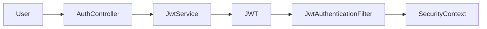
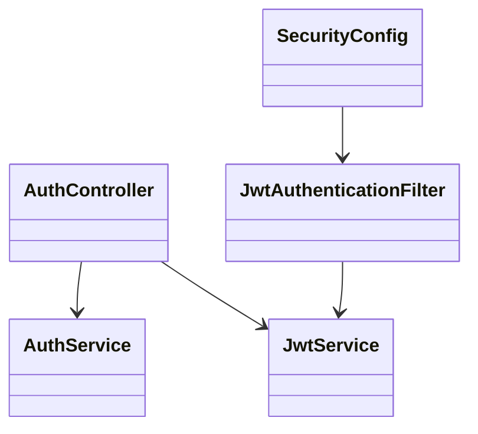
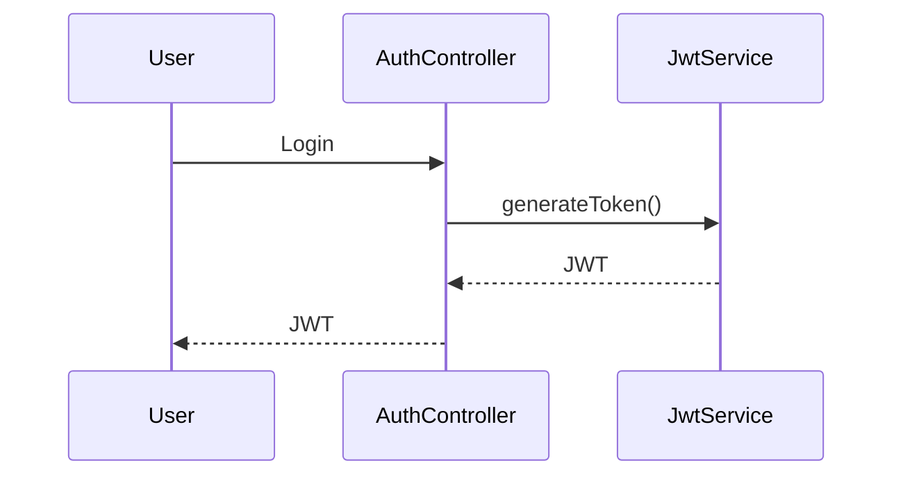
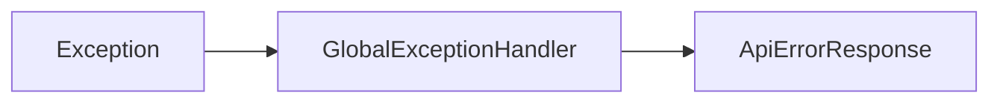
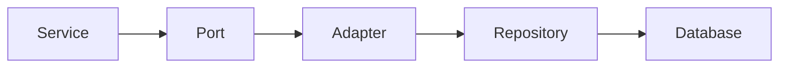
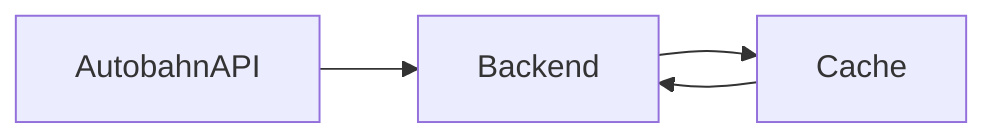
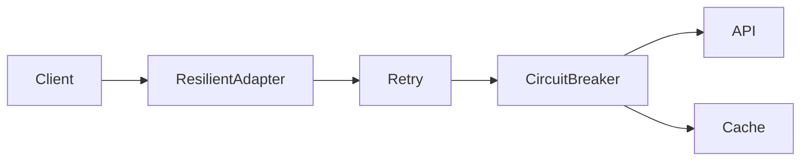
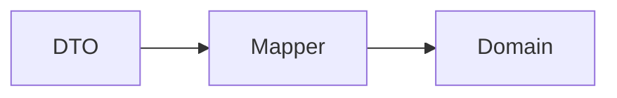
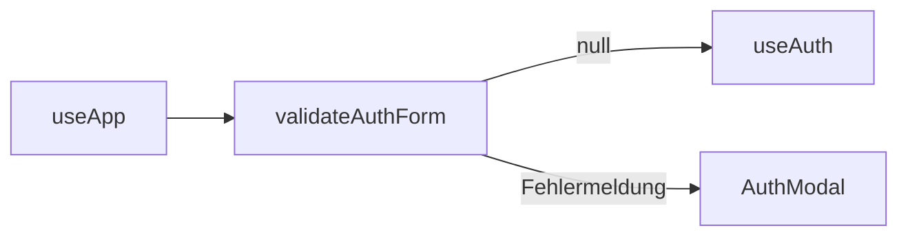
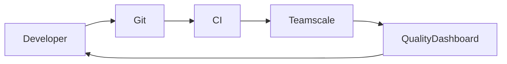

# 08. Querschnittliche Konzepte

## 8.1 Überblick

Dieses Kapitel beschreibt Architekturkonzepte, die mehrere Bausteine der Anwendung betreffen und somit nicht einer einzelnen Komponente zugeordnet werden können.

Die wichtigsten querschnittlichen Konzepte der SQS Verkehrsapp sind:

* Sicherheitskonzept
* Authentifizierung und Autorisierung
* Fehlerbehandlung
* Persistenzkonzept
* Caching-Konzept
* Resilience-Konzept
* Mapping-Konzept
* Domänenmodellierung
* Logging und Monitoring
* Konfigurationsmanagement

---

## 8.2 Sicherheitskonzept

### Zielsetzung

Die Anwendung schützt benutzerbezogene Funktionen vor unbefugtem Zugriff.

Dabei gelten folgende Anforderungen:

* Authentifizierung registrierter Benutzer
* Autorisierung geschützter Endpunkte
* sichere Passwortspeicherung
* Schutz vor Session-Manipulation

---

### Sicherheitsarchitektur





---

### Passwortspeicherung

Passwörter werden niemals im Klartext gespeichert.

#### Verfahren

```text
BCrypt
```

Eigenschaften:

* Salt-basiert
* Einwegfunktion
* Schutz vor Rainbow-Table-Angriffen

---

### Autorisierung

Geschützte Endpunkte erfordern ein gültiges JWT.

#### Öffentliche Endpunkte

```text
/api/auth/**
/api/traffic/**
/actuator/**
```

#### Geschützte Endpunkte

```text
/api/dashboard/**
/api/saved-roads/**
```

---

## 8.3 Authentifizierungskonzept

### JWT-basierte Authentifizierung

Die Anwendung verwendet JSON Web Tokens (JWT).

#### Ablauf



---

### Tokeninhalt

Das JWT enthält:

```text
userId
username
issuedAt
expiration
```

---

### Vorteile

* Stateless Authentication
* Horizontale Skalierbarkeit
* Keine Sessionverwaltung

---

## 8.4 Fehlerbehandlung

### Zielsetzung

Fehler sollen konsistent behandelt und für Clients verständlich aufbereitet werden.

---

### Architektur



---

### Fachliche Ausnahmen

#### UserException

Wird für benutzerbezogene Fehler verwendet.

Beispiele:

* ungültige Anmeldung
* Registrierungskonflikte

---

#### ExternalTrafficApiException

Fehler bei externer API-Kommunikation.

---

#### TrafficDataUnavailableException

Fehler beim Zugriff auf Verkehrsdaten.

Tritt auf wenn:

* API nicht erreichbar
* kein Cache-Fallback vorhanden

---

## 8.5 Persistenzkonzept

### Zielsetzung

Persistenzzugriffe sollen von der Fachlogik entkoppelt werden.

---

### Umsetzung



---

### Repositories

```text
UserRepository
SavedRoadRepository
CachedRoadEventRepository
AvailableRoadRepository
```

---

### Vorteile

* Trennung von Fachlogik und Infrastruktur
* Testbarkeit
* Austauschbarkeit

---

## 8.6 Caching-Konzept

### Zielsetzung

Erhöhung der Verfügbarkeit und Performance.

---

### Gespeicherte Daten

#### Verkehrsdaten

```text
RoadEvent
TrafficEventsResult
```

---

#### Verfügbare Autobahnen

```text
AvailableRoads
```

---

### Cache-Struktur



---

### Cache-Fallback

Bei Ausfall der API:

1. Suche im Cache.
2. Rückgabe gecachter Daten.
3. Fehler nur bei leerem Cache.

---

### Asynchrones Schreiben

Cache-Aktualisierungen erfolgen asynchron.

#### Vorteile

* geringere Antwortzeiten
* Entkopplung der Verarbeitung

---

## 8.7 Resilience-Konzept

### Zielsetzung

Vermeidung von Totalausfällen bei externen Störungen.

---

### Retry

Fehlgeschlagene Requests werden automatisch wiederholt.

#### Nutzen

* Behandlung temporärer Fehler
* Verbesserung der Verfügbarkeit

---

### Circuit Breaker

Verhindert wiederholte Aufrufe eines fehlerhaften Systems.

#### Nutzen

* Schutz externer Systeme
* schnellere Fehlerreaktion

---

### Fallback

Alternative Datenquelle:

```text
Lokaler Datenbank-Cache
```

---

### Resilience-Architektur



---

## 8.8 Mapping-Konzept

### Zielsetzung

Entkopplung externer Datenstrukturen von der Domäne.

---

### Architektur



---

### Mapper

```text
AutobahnApiMapper
```

---

### Vorteile

* Schutz vor API-Änderungen
* klare Verantwortlichkeiten
* einfache Testbarkeit

---

## 8.9 Domänenmodellierung

### Grundprinzip

Die Fachlogik wird ausschließlich innerhalb der Domäne modelliert.

---

### Domänenobjekte

```text
AppUser
SavedRoad
RoadEvent
TrafficEventsResult
SavedRoadTrafficResult
Coordinate
```

---

### Domänenlogik

```text
RiskScoreCalculator
```

---

### Risikobewertung

#### Risikostufen

```text
LOW
MEDIUM
HIGH
```

---

#### Ereignistypen

```text
WARNING
ROADWORK
CLOSURE
```

---

## 8.10 Konfigurationskonzept

### Zielsetzung

Trennung von Konfiguration und Anwendungscode.

---

### Externe Konfiguration

#### Autobahn API

```text
autobahn.api.baseUrl
```

---

### Vorteile

* flexible Deployment-Konfiguration
* unterschiedliche Umgebungen
* bessere Wartbarkeit

---

## 8.11 Logging-Konzept

### Zielsetzung

Nachvollziehbarkeit technischer Abläufe.

---

### Typische Log-Ereignisse

#### API-Kommunikation

```text
Autobahn API Requests
Autobahn API Fehler
```

---

#### Sicherheit

```text
Login
JWT Validierung
Authentifizierungsfehler
```

---

#### Persistenz

```text
Datenbankzugriffe
Cache-Aktualisierung
```

---

## 8.12 Monitoring-Konzept

### Actuator

Zur Überwachung der Anwendung werden Spring-Boot-Actuator-Endpunkte verwendet.

#### Mögliche Informationen

```text
Health
Metrics
Info
```

---

### Gesundheitszustand

Wichtige Komponenten:

* Datenbank
* Autobahn API
* Anwendung

---

## 8.13 Testkonzept

Dieses Kapitel beschreibt das Testkonzept der SQS-VerkehrsApp. Es dokumentiert die eingesetzten Testarten, Testwerkzeuge, Testumgebungen, Continuous-Integration-Prozesse sowie Maßnahmen zur Sicherung und Überwachung der Softwarequalität.

### Zielsetzung

Die Tests sollen sicherstellen, dass die VerkehrsApp fachlich korrekt, technisch stabil, sicher und langfristig wartbar bleibt.

Abgesichert werden insbesondere:

* korrekte Berechnung und Darstellung von Verkehrslagen und Risikobewertungen
* sichere Authentifizierung und Zugriffskontrolle
* robuste Verarbeitung externer Verkehrsdaten der Autobahn-API
* zuverlässige Speicherung und Anzeige persönlicher Autobahn-Favoriten
* Einhaltung der gewählten hexagonalen Architektur
* stabile Benutzeroberfläche für die wichtigsten Nutzerworkflows

### Teststrategie

Das Projekt verwendet eine mehrstufige Teststrategie.

| Ebene | Ziel | Beispiele im Projekt |
|---------|---------|---------|
| Backend Unit-Tests | Einzelne Klassen und Funktionen isoliert prüfen | Risiko-Score, Services, Mapper, Exception-Klassen |
| Controller-/Adapter-Tests | Web- und Infrastrukturadapter prüfen | Auth-, Traffic-, Saved-Road- und Dashboard-Controller |
| Integrationstests | Zusammenspiel mehrerer Komponenten prüfen | Authentifizierung, Persistenz, Security, REST-Endpunkte |
| Architekturtests | Architekturregeln automatisch prüfen | ArchUnit-Regeln für Domain, Application, Adapter und Ports |
| Frontend Unit-Tests | Hooks, Komponenten und Utilities isoliert prüfen | useApp, useAuth, useTraffic, validateAuthForm, RiskBadge |
| Frontend End-to-End-Tests | Nutzerworkflows im Browser prüfen | Login, Dashboard, Favoriten, Karte, Autobahnauswahl |
| Qualitäts- und Coverage-Analyse | Testabdeckung und Codequalität sichtbar machen | JaCoCo, LCOV, Teamscale, SonarCloud |

### Backend-Tests

Das Backend befindet sich unter:

```text
backend/sqs-verkehrsapp
```

Die Testklassen liegen unter:

```text
src/test/java
```

Die Testkonfiguration liegt unter:

```text
src/test/resources/application-test.properties
```

Das Backend wird mit Maven getestet.

#### Unit Tests

Unit Tests prüfen einzelne Komponenten isoliert und ohne vollständigen Start der Anwendung.

Die Tests enden auf:

```text
*Test.java
```

Die Ausführung erfolgt über das Maven-Surefire-Plugin.

##### Controller Tests

* AuthControllerTest
* DashboardControllerTest
* GlobalExceptionHandlerTest
* SavedRoadControllerTest
* TrafficControllerTest

##### Service Tests

* AuthServiceTest
* DashboardTrafficServiceTest
* SavedRoadServiceTest
* TrafficServiceTest

##### Adapter Tests

* AutobahnApiClientTest
* AutobahnApiMapperTest
* AutobahnCacheWriterTest
* ResilientAutobahnApiAdapterTest
* AvailableRoadsCacheAdapterTest
* RoadEventCacheAdapterTest
* SavedRoadAdapterTest
* UserAdapterTest

##### Domänenlogik

* RiskScoreCalculatorTest

Der Test überprüft die fachliche Risikobewertung der Verkehrsereignisse.

##### Exception Tests

* ExternalTrafficApiExceptionTest
* TrafficDataUnavailableExceptionTest
* UserAlreadyExistsExceptionTest

Die Exception-Tests stellen sicher, dass Fehlerfälle korrekt erzeugt und weitergegeben werden.

#### Integrationstests

Integrationstests prüfen das Zusammenspiel mehrerer Komponenten innerhalb des Spring-Kontexts.

Die Testklassen enden auf:

```text
*IntegrationTest.java
```

Die Ausführung erfolgt über das Maven-Failsafe-Plugin während der Maven-Phase:

```text
verify
```

##### Controller- und Web-Integration

* TrafficControllerIntegrationTest
* PublicTrafficEndpointIntegrationTest
* AuthSavedRoadIntegrationTest

##### Security-Integration

* SecurityPenetrationIntegrationTest

Prüft insbesondere:

* Authentifizierung
* Autorisierung
* Zugriffsschutz
* Sicherheitskonfiguration

##### Externe API-Integration

* AutobahnApiClientIntegrationTest
* ResilientAutobahnApiAdapterIntegrationTest

Prüft:

* Kommunikation mit externen Verkehrsdatenquellen
* Fehlerbehandlung
* Retry-Verhalten
* Circuit-Breaker-Verhalten

##### Persistenz-Integration

* CachedRoadEventRepositoryIntegrationTest
* SavedRoadRepositoryIntegrationTest

Prüft:

* Datenbankzugriffe
* Speicherung
* Lesen und Aktualisieren von Daten

##### Anwendungskontext

* ApplicationContextIntegrationTest

Prüft den vollständigen Start des Spring-Kontexts.

##### Ziel der Integrationstests

Die Integrationstests stellen sicher, dass zentrale Systemabläufe nicht nur isoliert, sondern im Zusammenspiel der Spring-Komponenten korrekt funktionieren.

Insbesondere werden geprüft:

* REST-Endpunkte
* Security-Konfiguration
* Persistenz
* externe Adapter
* Spring-Konfiguration

#### Testdaten und Testumgebung

Für Backend-Tests wird das Spring-Profil `test` verwendet.

Wichtige Eigenschaften:

* H2-In-Memory-Datenbank für schnelle und reproduzierbare Tests
* `ddl-auto=create-drop`
* frisches Datenbankschema für jeden Testlauf
* eigener JWT-Testschlüssel
* lokale Autobahn-API-Basis-URL für Adaptertests
* reduzierte Retry-Zeiten
* reduzierte Circuit-Breaker-Zeiten

Dadurch können Fehler- und Ausfallszenarien effizient getestet werden.

Zusätzlich werden Testcontainers-Abhängigkeiten verwendet, wenn realistischere Integrationstests gegen Container benötigt werden.

#### Konfigurationstests

##### WebClientConfigTest

Prüft die korrekte Konfiguration der HTTP-Kommunikation mit externen Diensten.

#### Architekturtests

Zur Sicherstellung der Architekturkonformität wird ArchUnit eingesetzt.

##### Architekturtest

* ArchitectureTest

##### Geprüfte Regeln

* Einhaltung der Hexagonalen Architektur
* Schichtentrennung
* zulässige Paketabhängigkeiten
* Controller liegen im Web-Adapter-Paket
* Services liegen in der Application-Schicht
* Ports sind Interfaces
* Domain-Code hängt nicht von Spring ab
* Domain-Code hängt nicht von Adapter-Schichten ab
* Domain-Code hängt nicht von der Application-Schicht ab
* Incoming- und Outgoing-Adapter bleiben voneinander getrennt
* Persistenz-Entities verbleiben im Persistenzadapter
* Repositories verbleiben im Persistenzadapter

Diese Tests laufen gemeinsam mit den übrigen Backend-Tests.

#### Eingesetzte Werkzeuge im Backend

* JUnit 5
* Mockito
* Spring Boot Test
* MockMvc
* ArchUnit
* H2 Database
* Testcontainers
* Maven Surefire Plugin
* Maven Failsafe Plugin

### Frontend-Tests

Das Frontend befindet sich unter:

```text
frontend
```

Die Unit-Tests liegen direkt neben den Quelldateien:

```text
frontend/src/**/*.test.ts
frontend/src/**/*.test.tsx
```

Die End-to-End-Tests befinden sich unter:

```text
frontend/tests
```

Das Frontend wird mit folgenden Testwerkzeugen getestet:

* Vitest (Unit-Tests)
* Playwright (End-to-End-Tests)

#### Unit-Tests mit Vitest

Die Vitest-Tests prüfen Hooks, Komponenten und Utility-Funktionen isoliert.

Geprüft werden unter anderem:

* Custom Hooks (`useApp`, `useAuth`, `useTraffic`, `useAutobahnSelector`, `useDashboard`)
* UI-Komponenten (`RiskBadge`, `AutobahnSelector`, `Dashboard` u. a.)
* Utility-Funktionen (`validateAuthForm`, `formatCachedAt`, `buildSavedMessage`)
* Service-Schicht (`trafficService`)

Die Tests verwenden gemockte Abhängigkeiten über `vi.mock`.

---

#### End-to-End-Tests mit Playwright

Die Playwright-Tests prüfen zentrale Nutzerabläufe im Browser.

Geprüft werden unter anderem:

* Grundzustand der Anwendung
* Start der Anwendung
* Autobahnauswahl
* Kartenansicht
* Risiko-Score-Anzeige
* Login
* Dashboard
* Speichern von Favoriten
* Löschen von Favoriten
* zentrale UI-Funktionen

Die Tests verwenden gemockte API-Antworten über Playwright-Routing.

Dadurch sind die Tests:

* reproduzierbar
* unabhängig von externen Diensten
* schnell ausführbar

#### Linting und Build

Neben den Browser-Tests werden zusätzliche Qualitätsprüfungen ausgeführt.

Der Build-Prozess führt aus:

1. TypeScript-Typprüfung
2. statische Analyse mittels ESLint
3. Produktionsbuild mit Vite

Dadurch werden Fehler bereits vor der Ausführung der Anwendung erkannt.

#### Frontend-Coverage

Für die Frontend-Coverage wird die Playwright-Testumgebung erweitert.

Datei:

```text
frontend/tests/coverage.ts
```

Nach jedem Test wird die Browser-Coverage aus:

```javascript
window.__coverage__
```

ausgelesen.

Die Daten werden in:

```text
.nyc_output
```

gespeichert.

Anschließend wird ein LCOV-Report erzeugt.

Report-Datei:

```text
frontend/coverage/lcov.info
```

### Continuous Integration

Alle automatisierten Prüfungen werden über GitHub Actions ausgeführt.

#### Backend CI

Workflow:

```text
.github/workflows/backend-ci.yml
```

Ausgeführt werden:

* Kompilierung
* Unit-Tests
* Integrationstests
* Architekturtests

#### Frontend CI

Workflow:

```text
.github/workflows/frontend-ci.yml
```

Ausgeführt werden:

* reproduzierbare Dependency-Installation
* TypeScript-Prüfung
* ESLint
* Build
* Playwright-Tests

#### Teamscale

Workflow:

```text
.github/workflows/teamscale-ci.yml
```

Teamscale wird für Testwise Coverage und Coverage-Uploads verwendet.

##### Verwendete Profile

Backend:

```text
teamscale-tia
```

Coverage:

```text
jacoco
```

##### Hochgeladene Daten

* JaCoCo-Coverage des Backends
* LCOV-Coverage des Frontends
* Testausführungen
* Qualitätsmetriken

#### SonarCloud

Workflow:

```text
.github/workflows/sonarcloud.yml
```

Vor der Analyse werden ausgeführt:

Backend:

```bash
./mvnw -B verify
```

Frontend:

* Linting
* TypeScript-Prüfung
* Build

Analysiert werden:

* Bugs
* Code Smells
* Sicherheitsprobleme
* Testabdeckung
* Wartbarkeit

### Coverage

#### Backend

Für das Backend wird JaCoCo verwendet.

Report:

```text
backend/sqs-verkehrsapp/target/site/jacoco/jacoco.xml
```

#### Frontend

Für das Frontend wird LCOV verwendet.

Report:

```text
frontend/coverage/lcov.info
```

### Testdaten

Für lokale Entwicklungs- und Demonstrationsszenarien existiert ein Testnutzer:

* Benutzername: `testuser`
* Passwort: `test123`
* gespeicherte Autobahnen:
    * `A3`
    * `A92`
---

## 8.14 Frontend-Validierung und Fehlerbehandlung

### Formularvalidierung

Das Frontend validiert Benutzereingaben vor dem Senden an das Backend.

#### Verantwortliche Komponente

```text
validateAuthForm (frontend/src/utils/validateAuthForm.ts)
```

#### Geprüfte Regeln

| Regel | Fehlermeldung |
|---|---|
| Benutzername und Passwort dürfen nicht leer sein | Bitte Benutzername und Passwort eingeben. |
| Benutzername mindestens 3 Zeichen | Benutzername muss mindestens 3 Zeichen lang sein. |
| Benutzername nur `[a-zA-Z0-9_-]` | Benutzername darf nur Buchstaben, Ziffern, _ und - enthalten. |
| Passwort mindestens 6 Zeichen | Passwort muss mindestens 6 Zeichen lang sein. |

#### Integration

`validateAuthForm` wird von `useApp` vor jedem Login- und Registrierungsversuch aufgerufen. Nur bei `null` (kein Fehler) wird die HTTP-Anfrage ausgelöst.



---

### Frontend-Fehlerbehandlung

Das Frontend behandelt Ladefehler in Hooks durch stille Fehlerbehandlung.

#### Prinzip

Schlägt ein API-Aufruf fehl, zeigt die Anwendung entweder eine Fehlermeldung an oder bleibt im letzten gültigen Zustand — die Anwendung bricht nicht ab.

#### Beispiele

| Fehlerfall | Verhalten |
|---|---|
| Autobahnen nicht ladbar | Fehlermeldung "Autobahnen konnten nicht geladen werden" |
| Verkehrsdaten nicht ladbar | Ereignisliste bleibt leer, kein Absturz |
| Login fehlgeschlagen | Modal bleibt offen, Fehlermeldung im `authError`-Zustand |

---

## 8.15 Zusammenfassung

Die querschnittlichen Konzepte bilden das technische Fundament der Anwendung.

Besonders wichtige Konzepte sind:

Backend:

* JWT-basierte Sicherheit
* zentrale Fehlerbehandlung
* datenbankgestütztes Caching
* Retry- und Circuit-Breaker-Mechanismen
* DTO-Mapping
* Spring Data JPA
* Domänengetriebene Risikobewertung

Frontend:

* Formularvalidierung (validateAuthForm)
* Graceful Error Handling in Hooks
* Hook/Component-Trennung nach SRP

Diese Konzepte unterstützen die Erreichung der definierten Qualitätsziele hinsichtlich Wartbarkeit, Sicherheit, Testbarkeit und Verfügbarkeit.

## 8.16 Kontinuierliche Softwarequalitätsüberwachung

Zur kontinuierlichen Überwachung der Softwarequalität wurde Teamscale in den Entwicklungsprozess integriert.



#### Überwachte Qualitätsmerkmale

Teamscale analysiert automatisiert Backend (JaCoCo) und Frontend (LCOV):

* Testabdeckung
* Code Smells
* Duplikate
* Komplexität
* Architekturverstöße
* Technische Schulden

#### Integration

Die Analyse erfolgt automatisiert über die Build- bzw. CI-Pipeline.

#### Nutzen

* Frühe Erkennung von Qualitätsproblemen
* Transparente Qualitätskennzahlen
* Unterstützung bei Refactorings
* Langfristige Sicherung der Wartbarkeit
* Nachvollziehbare Entwicklung der Codequalität
