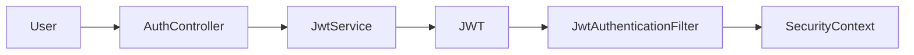
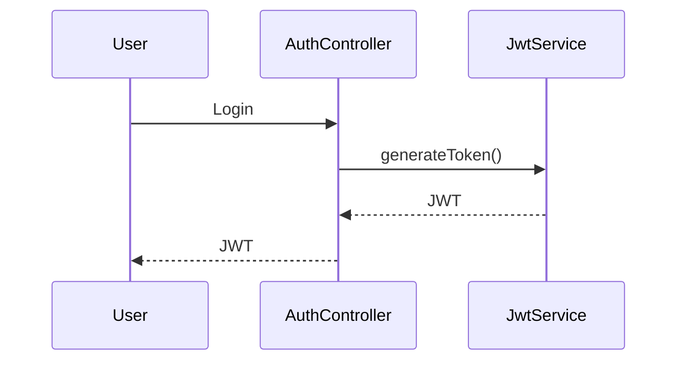
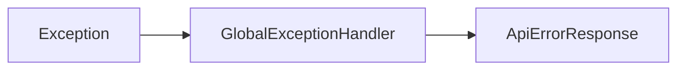
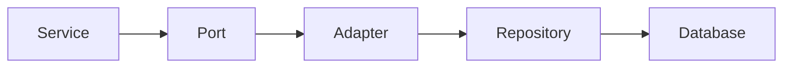
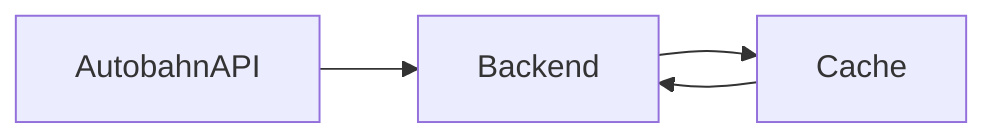
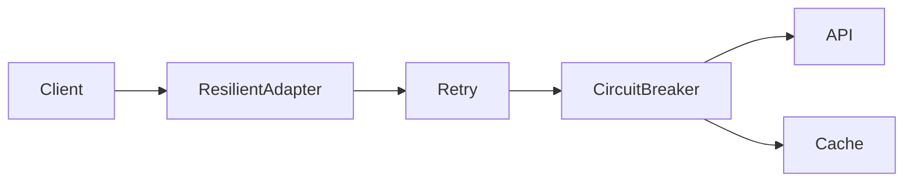
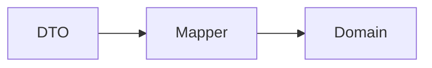

# 08. Querschnittliche Konzepte

## 8.1 Überblick

Dieses Kapitel beschreibt Architekturkonzepte, die mehrere Bausteine der Anwendung betreffen und somit nicht einer einzelnen Komponente zugeordnet werden können.

Die wichtigsten querschnittlichen Konzepte der SQS Verkehrsapp sind:

* Sicherheitskonzept
* Authentifizierung und Autorisierung
* Fehlerbehandlung
* Persistenzkonzept
* Caching-Konzept
* Resilience-Konzept
* Mapping-Konzept
* Domänenmodellierung
* Logging und Monitoring
* Konfigurationsmanagement

---

## 8.2 Sicherheitskonzept

### Zielsetzung

Die Anwendung schützt benutzerbezogene Funktionen vor unbefugtem Zugriff.

Dabei gelten folgende Anforderungen:

* Authentifizierung registrierter Benutzer
* Autorisierung geschützter Endpunkte
* sichere Passwortspeicherung
* Schutz vor Session-Manipulation

---

### Sicherheitsarchitektur



---

### Passwortspeicherung

Passwörter werden niemals im Klartext gespeichert.

#### Verfahren

```text id="k7cf3v"
BCrypt
```

Eigenschaften:

* Salt-basiert
* Einwegfunktion
* Schutz vor Rainbow-Table-Angriffen

---

### Autorisierung

Geschützte Endpunkte erfordern ein gültiges JWT.

#### Öffentliche Endpunkte

```text id="4kw5cg"
/api/auth/**
/api/traffic/**
/actuator/**
```

#### Geschützte Endpunkte

```text id="yn3xqs"
/api/dashboard/**
/api/saved-roads/**
```

---

## 8.3 Authentifizierungskonzept

### JWT-basierte Authentifizierung

Die Anwendung verwendet JSON Web Tokens (JWT).

#### Ablauf



---

### Tokeninhalt

Das JWT enthält:

```text id="8lqol7"
userId
username
issuedAt
expiration
```

---

### Vorteile

* Stateless Authentication
* Horizontale Skalierbarkeit
* Keine Sessionverwaltung

---

## 8.4 Fehlerbehandlung

### Zielsetzung

Fehler sollen konsistent behandelt und für Clients verständlich aufbereitet werden.

---

### Architektur



---

### Fachliche Ausnahmen

#### UserException

Wird für benutzerbezogene Fehler verwendet.

Beispiele:

* ungültige Anmeldung
* Registrierungskonflikte

---

#### ExternalTrafficApiException

Fehler bei externer API-Kommunikation.

---

#### TrafficDataUnavailableException

Fehler beim Zugriff auf Verkehrsdaten.

Tritt auf wenn:

* API nicht erreichbar
* kein Cache-Fallback vorhanden

---

## 8.5 Persistenzkonzept

### Zielsetzung

Persistenzzugriffe sollen von der Fachlogik entkoppelt werden.

---

### Umsetzung



---

### Repositories

```text id="nmzrl7"
UserRepository
SavedRoadRepository
CachedRoadEventRepository
AvailableRoadRepository
```

---

### Vorteile

* Trennung von Fachlogik und Infrastruktur
* Testbarkeit
* Austauschbarkeit

---

## 8.6 Caching-Konzept

### Zielsetzung

Erhöhung der Verfügbarkeit und Performance.

---

### Gespeicherte Daten

#### Verkehrsdaten

```text id="8v6o0h"
RoadEvent
TrafficEventsResult
```

---

#### Verfügbare Autobahnen

```text id="sws3bz"
AvailableRoads
```

---

### Cache-Struktur



---

### Cache-Fallback

Bei Ausfall der API:

1. Suche im Cache.
2. Rückgabe gecachter Daten.
3. Fehler nur bei leerem Cache.

---

### Asynchrones Schreiben

Cache-Aktualisierungen erfolgen asynchron.

#### Vorteile

* geringere Antwortzeiten
* Entkopplung der Verarbeitung

---

## 8.7 Resilience-Konzept

### Zielsetzung

Vermeidung von Totalausfällen bei externen Störungen.

---

### Retry

Fehlgeschlagene Requests werden automatisch wiederholt.

#### Nutzen

* Behandlung temporärer Fehler
* Verbesserung der Verfügbarkeit

---

### Circuit Breaker

Verhindert wiederholte Aufrufe eines fehlerhaften Systems.

#### Nutzen

* Schutz externer Systeme
* schnellere Fehlerreaktion

---

### Fallback

Alternative Datenquelle:

```text id="a67h5h"
Lokaler Datenbank-Cache
```

---

### Resilience-Architektur



---

## 8.8 Mapping-Konzept

### Zielsetzung

Entkopplung externer Datenstrukturen von der Domäne.

---

### Architektur



---

### Mapper

```text id="aw1nmp"
AutobahnApiMapper
```

---

### Vorteile

* Schutz vor API-Änderungen
* klare Verantwortlichkeiten
* einfache Testbarkeit

---

## 8.9 Domänenmodellierung

### Grundprinzip

Die Fachlogik wird ausschließlich innerhalb der Domäne modelliert.

---

### Domänenobjekte

```text id="i1n6d9"
AppUser
SavedRoad
RoadEvent
TrafficEventsResult
SavedRoadTrafficResult
Coordinate
```

---

### Domänenlogik

```text id="2dfdlt"
RiskScoreCalculator
```

---

### Risikobewertung

#### Risikostufen

```text id="yksl7z"
LOW
MEDIUM
HIGH
```

---

#### Ereignistypen

```text id="wy1u5x"
WARNING
ROADWORK
CLOSURE
```

---

## 8.10 Konfigurationskonzept

### Zielsetzung

Trennung von Konfiguration und Anwendungscode.

---

### Externe Konfiguration

#### Autobahn API

```text id="1mr1dr"
autobahn.api.baseUrl
```

---

### Vorteile

* flexible Deployment-Konfiguration
* unterschiedliche Umgebungen
* bessere Wartbarkeit

---

## 8.11 Logging-Konzept

### Zielsetzung

Nachvollziehbarkeit technischer Abläufe.

---

### Typische Log-Ereignisse

#### API-Kommunikation

```text id="vxjntf"
Autobahn API Requests
Autobahn API Fehler
```

---

#### Sicherheit

```text id="s3yq7f"
Login
JWT Validierung
Authentifizierungsfehler
```

---

#### Persistenz

```text id="e3hf8s"
Datenbankzugriffe
Cache-Aktualisierung
```

---

## 8.12 Monitoring-Konzept

### Actuator

Zur Überwachung der Anwendung werden Spring-Boot-Actuator-Endpunkte verwendet.

#### Mögliche Informationen

```text id="x7jlwm"
Health
Metrics
Info
```

---

### Gesundheitszustand

Wichtige Komponenten:

* Datenbank
* Autobahn API
* Anwendung

---

## 8.13 Testkonzept

Zur Sicherstellung der Softwarequalität wird eine mehrstufige Teststrategie eingesetzt.

#### Unit Tests

Unit Tests prüfen einzelne Komponenten isoliert.

##### Controller Tests

* AuthControllerTest
* DashboardControllerTest
* GlobalExceptionHandlerTest
* SavedRoadControllerTest
* TrafficControllerTest

##### Service Tests

* AuthServiceTest
* DashboardTrafficServiceTest
* SavedRoadServiceTest
* TrafficServiceTest

##### Adapter Tests

* AutobahnApiClientTest
* AutobahnApiMapperTest
* AutobahnCacheWriterTest
* ResilientAutobahnApiAdapterTest
* AvailableRoadsCacheAdapterTest
* RoadEventCacheAdapterTest
* SavedRoadAdapterTest
* UserAdapterTest

##### Domänenlogik

* RiskScoreCalculatorTest

##### Exception Tests

* ExternalTrafficApiExceptionTest
* TrafficDataUnavailableExceptionTest
* UserAlreadyExistsExceptionTest

#### Integrationstests

Integrationstests prüfen das Zusammenspiel mehrerer Komponenten innerhalb des Spring-Kontexts sowie die korrekte Integration von REST-Schnittstellen, Security, Persistenz und externen API-Adaptern.

##### Controller- und Web-Integration

- TrafficControllerIntegrationTest
- PublicTrafficEndpointIntegrationTest
- AuthSavedRoadIntegrationTest

##### Security-Integration

- SecurityPenetrationIntegrationTest

##### Externe API-Integration

- AutobahnApiClientIntegrationTest
- ResilientAutobahnApiAdapterIntegrationTest

##### Persistenz-Integration

- CachedRoadEventRepositoryIntegrationTest
- SavedRoadRepositoryIntegrationTest

##### Anwendungskontext

- ApplicationContextIntegrationTest

#### Ziel der Integrationstests

Die Integrationstests stellen sicher, dass zentrale Systemabläufe nicht nur isoliert, sondern im Zusammenspiel der Spring-Komponenten korrekt funktionieren.


#### Konfigurationstests

* WebClientConfigTest

#### Architekturtests

Zur Sicherstellung der Architekturkonformität wird ein dedizierter Architekturtest verwendet:

* ArchitectureTest

Geprüft werden unter anderem:

* Einhaltung der Hexagonalen Architektur
* Schichtentrennung
* Zulässige Paketabhängigkeiten

#### Eingesetzte Werkzeuge

* JUnit 5
* Mockito
* Spring Boot Test
* MockMvc
* ArchUnit

---

## 8.14 Zusammenfassung

Die querschnittlichen Konzepte bilden das technische Fundament der Anwendung.

Besonders wichtige Konzepte sind:

* JWT-basierte Sicherheit
* zentrale Fehlerbehandlung
* datenbankgestütztes Caching
* Retry- und Circuit-Breaker-Mechanismen
* DTO-Mapping
* Spring Data JPA
* Domänengetriebene Risikobewertung

Diese Konzepte unterstützen die Erreichung der definierten Qualitätsziele hinsichtlich Wartbarkeit, Sicherheit, Testbarkeit und Verfügbarkeit.

### 8.15 Kontinuierliche Softwarequalitätsüberwachung

Zur kontinuierlichen Überwachung der Softwarequalität wurde Teamscale in den Entwicklungsprozess integriert.

#### Überwachte Qualitätsmerkmale

Teamscale analysiert automatisiert:

* Testabdeckung
* Code Smells
* Duplikate
* Komplexität
* Architekturverstöße
* Technische Schulden

#### Integration

Die Analyse erfolgt automatisiert über die Build- bzw. CI-Pipeline.

#### Nutzen

* Frühe Erkennung von Qualitätsproblemen
* Transparente Qualitätskennzahlen
* Unterstützung bei Refactorings
* Langfristige Sicherung der Wartbarkeit
* Nachvollziehbare Entwicklung der Codequalität

````

```mermaid
flowchart LR

Developer --> Git

Git --> CI

CI --> Teamscale

Teamscale --> QualityDashboard

QualityDashboard --> Developer
````
