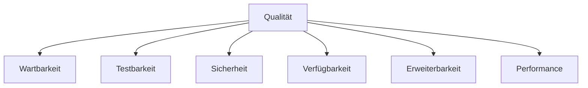

# 10. Qualitätsanforderungen

## 10.1 Überblick

Dieses Kapitel beschreibt die wichtigsten Qualitätsanforderungen der SQS Verkehrsapp.

Die Qualitätsziele wurden aus den fachlichen Anforderungen sowie den technischen Randbedingungen abgeleitet und beeinflussen maßgeblich die Architekturentscheidungen des Systems.

Im Fokus stehen insbesondere:

* Wartbarkeit
* Testbarkeit
* Sicherheit
* Verfügbarkeit
* Erweiterbarkeit
* Performance

---

## 10.2 Qualitätsbaum

Der Qualitätsbaum stellt die priorisierten Qualitätsmerkmale der Anwendung dar.

---

## 10.3 Priorisierte Qualitätsziele

### QZ-1 Wartbarkeit

#### Priorität

Sehr hoch

#### Beschreibung

Die Architektur soll Änderungen und Erweiterungen mit minimalem Aufwand ermöglichen.

#### Unterstützende Maßnahmen

Backend:

* Hexagonale Architektur
* Ports & Adapters
* DTO-Mapping
* Single Responsibility Principle

Frontend:

* Hook/Component-Trennung (zustandslose Komponenten)
* Zentraler `trafficService` für alle HTTP-Aufrufe

#### Bewertung

Änderungen an Infrastrukturkomponenten dürfen keine Anpassungen der Fachlogik erfordern.

---

### QZ-2 Testbarkeit

#### Priorität

Sehr hoch

#### Beschreibung

Fachlogik soll unabhängig von technischen Abhängigkeiten testbar sein.

#### Unterstützende Maßnahmen

Backend:

* Input Ports
* Output Ports
* Dependency Injection
* Mocking von Ports

Frontend:

* Vitest für Unit-Tests von Hooks, Komponenten und Utilities
* Playwright für End-to-End-Tests der Nutzerworkflows
* Gemockte API-Antworten über Playwright-Routing

#### Bewertung

Unit-Tests sollen ohne Datenbank oder externe API ausführbar sein.

Neben Unit Tests werden Integrationstests eingesetzt, um kritische Systempfade über mehrere Schichten hinweg zu prüfen. Dazu gehören öffentliche Traffic-Endpunkte, geschützte Benutzerfunktionen, Security-Regeln, Repository-Zugriffe und die externe Autobahn-API-Integration.

Neben Unit- und Integrationstests werden Architekturtests mit ArchUnit eingesetzt, um die Einhaltung der Hexagonalen Architektur automatisiert sicherzustellen.

---

### QZ-3 Sicherheit

#### Priorität

Sehr hoch

#### Beschreibung

Benutzerbezogene Funktionen müssen vor unbefugtem Zugriff geschützt werden.

#### Unterstützende Maßnahmen

Backend:

* JWT-Authentifizierung
* Spring Security
* BCrypt
* Security Filter

Frontend:

* Formularvalidierung vor dem Senden (`validateAuthForm`)
* Fehlermeldungen bei ungültigen Eingaben

#### Bewertung

Geschützte Ressourcen dürfen ausschließlich authentifizierten Benutzern zugänglich sein.

---

### QZ-4 Verfügbarkeit

#### Priorität

Sehr hoch

#### Beschreibung

Die Anwendung soll auch bei Störungen externer Systeme möglichst verfügbar bleiben.

#### Unterstützende Maßnahmen

Backend:

* Retry
* Circuit Breaker
* Cache Fallback
* Datenbankgestützter Cache

Frontend:

* Graceful Error Handling in Hooks (kein Absturz bei Ladefehlern)
* Cache-Status-Anzeige ("Gecacht · HH:MM") bei API-Ausfall

#### Bewertung

Bei API-Ausfällen sollen Verkehrsdaten möglichst weiterhin bereitgestellt werden.

---

### QZ-5 Erweiterbarkeit

#### Priorität

Hoch

#### Beschreibung

Neue Funktionen sollen ohne umfangreiche Architekturänderungen integrierbar sein.

#### Unterstützende Maßnahmen

Backend:

* Ports
* Adapter
* Entkopplung von Infrastruktur

Frontend:

* Zentraler `trafficService` — neue Endpunkte an einer Stelle ergänzbar
* Zustandslose Komponenten — neue UI-Elemente ohne Seiteneffekte integrierbar

#### Bewertung

Neue Datenquellen sollen durch zusätzliche Adapter integriert werden können.

---

### QZ-6 Performance

#### Priorität

Mittel

#### Beschreibung

Antwortzeiten sollen auch bei häufigen Anfragen niedrig bleiben.

#### Unterstützende Maßnahmen

Backend:

* Lokaler Cache
* Asynchrones Schreiben
* Reduzierte API-Aufrufe

Frontend:

* Einmaliges Laden beim Start (kein wiederholtes Fetching)
* Cache-Anzeige statt Fehlermeldung bei API-Ausfall

#### Bewertung

Wiederkehrende Daten sollen bevorzugt aus dem Cache bereitgestellt werden.

---

## 10.4 Qualitätsszenarien

Die folgenden Szenarien konkretisieren die Qualitätsanforderungen.

---

### QS-01 Wartbarkeit

#### Qualitätsmerkmal

Wartbarkeit

#### Szenario

**Gegeben**

Eine neue Verkehrsdatenquelle soll integriert werden.

**Wenn**

Ein Entwickler die Anwendung erweitert.

**Dann**

Soll lediglich ein neuer Adapter implementiert werden, ohne Änderungen an der Fachlogik vornehmen zu müssen.

#### Architekturunterstützung

* Hexagonale Architektur
* AutobahnApiPort

---

### QS-02 Testbarkeit

#### Qualitätsmerkmal

Testbarkeit

#### Szenario

**Gegeben**

Ein Entwickler möchte die Risikoberechnung testen.

**Wenn**

Unit-Tests ausgeführt werden.

**Dann**

Soll die Berechnung ohne Datenbank oder externe API getestet werden können.

#### Architekturunterstützung

* RiskScoreCalculator
* Dependency Injection

#### Qualitätsmessung

Die Testbarkeit wird anhand folgender Kriterien bewertet:

Backend:

* Automatisierte Unit-Tests
* Automatisierte Integrationstests
* Architekturtests mittels ArchUnit
* Testausführung innerhalb der CI-Pipeline

Frontend:

* Vitest Unit-Tests für Hooks, Komponenten und Utilities
* Playwright End-to-End-Tests für Nutzerworkflows
* Testausführung innerhalb der CI-Pipeline

Ziel ist die frühzeitige Erkennung funktionaler und architektonischer Fehler.

---

### QS-03 Sicherheit

#### Qualitätsmerkmal

Sicherheit

#### Szenario

**Gegeben**

Ein nicht authentifizierter Benutzer ruft eine geschützte Ressource auf.

**Wenn**

Die Anfrage verarbeitet wird.

**Dann**

Muss der Zugriff verweigert werden.

#### Architekturunterstützung

* JwtAuthenticationFilter
* SecurityConfig

---

### QS-04 Passwortschutz

#### Qualitätsmerkmal

Sicherheit

#### Szenario

**Gegeben**

Ein Benutzer registriert sich.

**Wenn**

Das Passwort gespeichert wird.

**Dann**

Darf ausschließlich ein Passwort-Hash gespeichert werden.

#### Architekturunterstützung

* BCryptPasswordEncoder

---

### QS-05 API-Ausfall

#### Qualitätsmerkmal

Verfügbarkeit

#### Szenario

**Gegeben**

Die Autobahn API ist nicht erreichbar.

**Wenn**

Verkehrsdaten abgefragt werden.

**Dann**

Sollen gecachte Daten zurückgegeben werden.

#### Architekturunterstützung

* RoadEventCachePort
* ResilientAutobahnApiAdapter

---

### QS-06 Vollständiger Ausfall

#### Qualitätsmerkmal

Verfügbarkeit

#### Szenario

**Gegeben**

API und Cache liefern keine Daten.

**Wenn**

Eine Verkehrsabfrage erfolgt.

**Dann**

Soll eine fachliche Fehlermeldung zurückgegeben werden.

#### Architekturunterstützung

* TrafficDataUnavailableException
* GlobalExceptionHandler

---

### QS-07 Dashboard-Ladezeit

#### Qualitätsmerkmal

Performance

### Szenario

**Gegeben**

Ein Benutzer besitzt mehrere gespeicherte Autobahnen.

**Wenn**

Das Dashboard geladen wird.

**Dann**

Sollen die Daten innerhalb einer akzeptablen Antwortzeit bereitgestellt werden.

#### Architekturunterstützung

* Caching
* Asynchrone Verarbeitung

---

### QS-08 Erweiterbarkeit

#### Qualitätsmerkmal

Erweiterbarkeit

#### Szenario

**Gegeben**

Ein neuer Verkehrsereignistyp wird eingeführt.

**Wenn**

Die Fachlogik erweitert wird.

**Dann**

Sollen nur die Domänenlogik und die Risikobewertung angepasst werden.

#### Architekturunterstützung

* RoadEventType
* RiskScoreCalculator

---

### QS-09 Frontend-Formularvalidierung

#### Qualitätsmerkmal

Sicherheit

#### Szenario

**Gegeben**

Ein Benutzer gibt einen zu kurzen Benutzernamen ein.

**Wenn**

Er auf „Anmelden" klickt.

**Dann**

Soll eine Fehlermeldung angezeigt werden, ohne dass eine HTTP-Anfrage gesendet wird.

#### Architekturunterstützung

* `validateAuthForm`
* `useApp` (handleLoginSubmit)

---

### QS-10 Frontend-Cache-Anzeige

#### Qualitätsmerkmal

Verfügbarkeit

#### Szenario

**Gegeben**

Die Autobahn API ist nicht erreichbar und das Backend liefert gecachte Daten.

**Wenn**

Der Benutzer die Seite öffnet.

**Dann**

Soll das Frontend die Daten anzeigen und den Cache-Zeitpunkt sichtbar machen.

#### Architekturunterstützung

* `useTraffic` (isLive, cachedAt)
* `PageHero` (Cache-Status-Anzeige)
* `formatCachedAt`

---

## 10.5 Qualitätsszenario-Matrix

| Szenario | Wartbarkeit | Testbarkeit | Sicherheit | Verfügbarkeit | Erweiterbarkeit | Performance |
| -------- | ----------- | ----------- | ---------- | ------------- | --------------- | ----------- |
| QS-01    | X           |             |            |               | X               |             |
| QS-02    |             | X           |            |               |                 |             |
| QS-03    |             |             | X          |               |                 |             |
| QS-04    |             |             | X          |               |                 |             |
| QS-05    |             |             |            | X             |                 |             |
| QS-06    |             |             |            | X             |                 |             |
| QS-07    |             |             |            |               |                 | X           |
| QS-08    | X           |             |            |               | X               |             |
| QS-09    |             |             | X          |               |                 |             |
| QS-10    |             |             |            | X             |                 |             |

---

## 10.6 Qualitätsmaßnahmen

### Backend-Architekturmaßnahmen

#### Hexagonale Architektur

Verbessert:

* Wartbarkeit
* Testbarkeit
* Erweiterbarkeit

---

#### JWT und Spring Security

Verbessern:

* Sicherheit
* Zugriffsschutz

---

#### Resilience4j

Verbessert:

* Verfügbarkeit
* Fehlertoleranz

---

#### Caching

Verbessert:

* Verfügbarkeit
* Performance

---

#### Spring Data JPA

Verbessert:

* Wartbarkeit
* Produktivität

---

### Frontend-Architekturmaßnahmen

#### Hook/Component-Trennung

Verbessert:

* Wartbarkeit
* Testbarkeit

---

#### Zentraler trafficService

Verbessert:

* Wartbarkeit
* Erweiterbarkeit

---

#### validateAuthForm

Verbessert:

* Sicherheit
* Benutzererfahrung

---

#### Graceful Error Handling in Hooks

Verbessert:

* Verfügbarkeit
* Benutzererfahrung

---

#### Vitest und Playwright

Verbessern:

* Testbarkeit

---

## 10.7 Risiken bezüglich der Qualitätsziele

### Sicherheit

#### Risiko

JWT-Tokens können derzeit nicht aktiv widerrufen werden.

---

### Verfügbarkeit

#### Risiko

Die Qualität des Fallback-Mechanismus hängt von der Aktualität des Caches ab.

---

### Performance

#### Risiko

Das Dashboard führt mehrere Verkehrsabfragen durch.

Bei sehr vielen gespeicherten Autobahnen kann die Antwortzeit steigen.

---

## 10.8 Zusammenfassung

Die Architektur der SQS Verkehrsapp wurde gezielt zur Unterstützung der priorisierten Qualitätsziele entwickelt.

Besonders stark adressiert werden:

Backend:

* Wartbarkeit durch Hexagonale Architektur
* Testbarkeit durch Ports und Adapter
* Sicherheit durch JWT und Spring Security
* Verfügbarkeit durch Retry, Circuit Breaker und Cache-Fallback
* Erweiterbarkeit durch klare Schnittstellen
* Performance durch Caching und asynchrone Verarbeitung

Frontend:

* Wartbarkeit durch Hook/Component-Trennung
* Testbarkeit durch Vitest und Playwright
* Sicherheit durch Formularvalidierung
* Verfügbarkeit durch Graceful Error Handling und Cache-Anzeige

Die definierten Qualitätsszenarien dienen als Grundlage für die Bewertung und Weiterentwicklung der Systemarchitektur.

